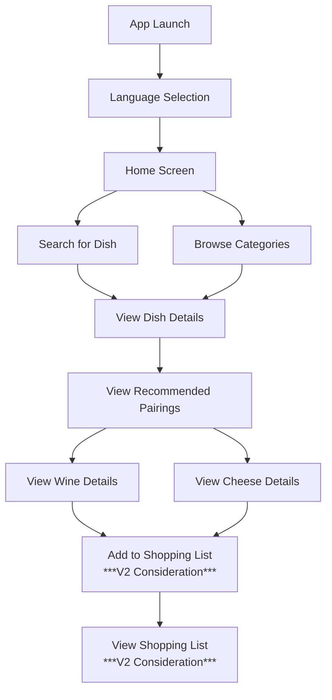

# Functional Specifications - Intermarché Wine & Cheese Pairing App

## Executive Summary

This document outlines the functional requirements for a mobile application serving a specific Intermarché location in the South of France. The app will help customers find appropriate wine and cheese pairings based on dishes they select. The primary audience includes both local French customers and tourists visiting the region. The application prioritizes simplicity, accessibility, and multilingual support to enhance the shopping experience without requiring user accounts or complex interactions.

## Document Control

| Version | Date | Author | Changes |
|---------|------|--------|---------|
| 1.0 | 2025-05-12 | Mathias DELILLE | Initial version |

## Table of Contents (YOU ARE HERE)

Click to view

- [Functional Specifications - Intermarché Wine \& Cheese Pairing App](#functional-specifications---intermarché-wine--cheese-pairing-app)
  - [Executive Summary](#executive-summary)
  - [Document Control](#document-control)
  - [Table of Contents (YOU ARE HERE)](#table-of-contents-you-are-here)
  - [1. Project Overview](#1-project-overview)
    - [1.1 Purpose](#11-purpose)
    - [1.2 Business Objectives](#12-business-objectives)
    - [1.3 Target Users](#13-target-users)
  - [2. User Experience \& Interface Requirements](#2-user-experience--interface-requirements)
    - [2.1 App Entry \& Language Selection](#21-app-entry--language-selection)
    - [2.2 Core User Flow](#22-core-user-flow)
    - [2.3 User Interface Guidelines](#23-user-interface-guidelines)
  - [3. Detailed Functional Requirements](#3-detailed-functional-requirements)
    - [3.1 Dish Selection Module](#31-dish-selection-module)
    - [3.2 Pairing Engine](#32-pairing-engine)
    - [3.3 Product Information Display](#33-product-information-display)
    - [3.4 Shopping List Feature *(V2 Consideration)*](#34-shopping-list-feature-v2-consideration)
    - [3.5 Store Information](#35-store-information)
  - [4. Multilingual Support](#4-multilingual-support)
    - [4.1 Translation Requirements](#41-translation-requirements)
    - [4.2 Language-Specific Considerations](#42-language-specific-considerations)
  - [5. Data Requirements](#5-data-requirements)
    - [5.1 Product Database](#51-product-database)
    - [5.2 Data Maintenance](#52-data-maintenance)
  - [6. Performance Requirements](#6-performance-requirements)
    - [6.1 Response Time](#61-response-time)
    - [6.2 Offline Capability](#62-offline-capability)
    - [6.3 Device Compatibility](#63-device-compatibility)
  - [7. Integration Points](#7-integration-points)
    - [7.1 Intermarché Product System](#71-intermarché-product-system)
    - [7.2 Store Navigation *(V2 Consideration)*](#72-store-navigation-v2-consideration)
  - [8. Success Criteria](#8-success-criteria)
    - [8.1 Key Performance Indicators](#81-key-performance-indicators)
    - [8.2 User Satisfaction Metrics](#82-user-satisfaction-metrics)
  - [9. Constraints \& Limitations](#9-constraints--limitations)
    - [9.1 Technical Constraints](#91-technical-constraints)
    - [9.2 Business Constraints](#92-business-constraints)
  - [10. Future Considerations (v2.0)](#10-future-considerations-v20)
  - [11. Document Quality Assurance Guidelines](#11-document-quality-assurance-guidelines)
    - [11.1 Document Review Process](#111-document-review-process)
    - [11.2 Quality Metrics for Specifications](#112-quality-metrics-for-specifications)
    - [11.3 Program Manager Responsibilities](#113-program-manager-responsibilities)
    - [11.4 Document Maintenance](#114-document-maintenance)
  - [12. Visual Aids \& Conceptual Designs](#12-visual-aids--conceptual-designs)
    - [12.1 Purpose of Visual Documentation](#121-purpose-of-visual-documentation)
    - [12.2 User Flow Diagram](#122-user-flow-diagram)
    - [12.3 Mockups Reference](#123-mockups-reference)
    - [12.4 Disclaimer on Visual Materials](#124-disclaimer-on-visual-materials)
  - [13. Project Roadmap](#13-project-roadmap)
    - [13.1 MoSCoW Prioritization](#131-moscow-prioritization)
      - [Must Have](#must-have)
      - [Should Have](#should-have)
      - [Could Have](#could-have)
      - [Won't Have](#wont-have)
    - [13.2 Development Phases](#132-development-phases)
    - [13.3 Timeline Considerations](#133-timeline-considerations)
    - [13.4 Key Milestones](#134-key-milestones)
    - [13.5 Technical Guardrails](#135-technical-guardrails)
  - [14. User Scenarios](#14-user-scenarios)
  - [15. Success Metrics](#15-success-metrics)
  - [16. Key Stakeholders](#16-key-stakeholders)
  - [17. Glossary](#17-glossary)

## 1. Project Overview

### 1.1 Purpose

This mobile application aims to help customers of Intermarché in the South of France find appropriate wine and cheese pairings based on dishes they select. The primary target audience is tourists visiting the region who may be unfamiliar with local products and traditional pairings.

### 1.2 Business Objectives

- Enhance customer experience in Intermarché stores
- Increase sales of regional wines and cheeses
- Promote local gastronomy and culinary tradition
- Differentiate Intermarché from competitors through innovative customer service

### 1.3 Target Users

- French locals from the surrounding area
- Tourists visiting Southern France (primary international users)
- Elderly users with potential accessibility needs
- Users with varying levels of wine and cheese knowledge
- Users with visual impairments including color blindness

## 2. User Experience & Interface Requirements

### 2.1 App Entry & Language Selection

- The app must launch directly to a language selection screen
- Minimum required languages: French and English
- Language selection must be persistent across app sessions
- Language can be changed at any time through accessible settings

### 2.2 Core User Flow

1. Select language
2. Browse or search for a dish
3. View recommended wine and cheese pairings
4. View product details and locate in store
5. *(V2 Consideration)*: Create shopping list

### 2.3 User Interface Guidelines

- Clean, minimalist interface with emphasis on visual representation of products
- Maximum 3 clicks to reach any core function
- Typography must be readable in bright daylight (store environment)
- UI elements sized appropriately for one-handed mobile use
- Design must accommodate both languages without layout changes
- Accessibility features for elderly users (larger tap targets, adjustable text size)
- Color schemes must accommodate color blindness (avoid red/green distinctions for critical functions)

## 3. Detailed Functional Requirements

### 3.1 Dish Selection Module

- **Browse Categories**: Hierarchical browsing by cuisine type, meal course, or cooking method
- **Search Functionality**: Text search with auto-suggestions and error tolerance
- **Popular Dishes** *(V2 Consideration)*: Highlighted section for regional specialties and common tourist requests
- **Recent Selections** *(V2 Consideration)*: Display recently viewed dishes for quick access
- **Visual Representation**: Each dish must have a high-quality image

### 3.2 Pairing Engine

- **Wine Recommendations**: 2-3 wine options per dish, representing different price points
- **Cheese Recommendations**: 2-3 cheese options per dish
- **Pairing Logic**: Clear explanation of why each product pairs well with the selected dish
- **Alternative Suggestions**: Option to view alternative pairings if preferred

### 3.3 Product Information Display

- **Wine Information**: Varietal, region, taste profile, price range, bottle image
  - Must include legal age requirement notices for all alcoholic products
- **Cheese Information**: Type, region, texture, flavor profile, price range, image
  - Must include allergen information clearly displayed
- **Availability** *(V2 Consideration)*: Real-time stock information at the specific Intermarché location
- **Location** *(V2 Consideration)*: Aisle and section information for easy in-store navigation

### 3.4 Shopping List Feature *(V2 Consideration)*

- **Add/Remove Items**: Simple controls to add wines and cheeses to a shopping list
- **List Management**: Ability to adjust quantities
- **List Sharing**: Option to share list via standard sharing methods (email, message, etc.)
- **List Persistence**: Shopping list must persist between app sessions
- **No Account Required**: List stored locally on device, no user account creation

### 3.5 Store Information

- **Store Layout** *(V2 Consideration)*: Simplified map showing wine and cheese departments
- **Opening Hours**: Current store hours with holiday exceptions
- **Contact Information**: Store phone number and address

## 4. Multilingual Support

### 4.1 Translation Requirements

- All app content must be available in both French and English
- Translation must preserve context and accuracy for culinary terminology
- Descriptions must maintain consistent tone and style across languages
- Units of measurement appropriate to language context (metric primary)

### 4.2 Language-Specific Considerations

- French language version should include regional terminology for Southern France
- English version should use internationally recognizable terms with explanations of French specialties

## 5. Data Requirements

### 5.1 Product Database

- Comprehensive catalog of wines sold at the specific Intermarché location
- Complete cheese inventory with detailed descriptions
- Pairing rules and recommendations from wine and cheese department employees
- Product information will be initially created by developers with input from store experts (Célia Moustier and Chrys Cadeau)

### 5.2 Data Maintenance

- Process for regular updates to product inventory
- Mechanism to reflect seasonal product availability
- Method to update pricing information

> [!NOTE]
>
> No admin CRUD interface will be available after development; updates will require developer intervention

## 6. Performance Requirements

### 6.1 Response Time

- App launch: Under 2 seconds
- Screen transitions: Under 0.5 seconds
- Search results: Under 1 second
- Product information loading: Under 1 second

### 6.2 Offline Capability

- Core product information must be available offline
- Real-time stock information requires connectivity *(V2 Consideration)*
- Graceful degradation of features when offline

### 6.3 Device Compatibility

- iOS: Two most recent major versions
- Android: API level 26 (Android 8.0) and above
- Responsive design to accommodate various screen sizes

## 7. Integration Points

### 7.1 Intermarché Product System

- Integration with store inventory system for product information
- Stock level information from store database *(V2 Consideration)*
- Price information synchronization

### 7.2 Store Navigation *(V2 Consideration)*

- Integration with store layout data
- Product location mapping

## 8. Success Criteria

### 8.1 Key Performance Indicators

- Average time to find a pairing recommendation: Under 30 seconds
- Percentage of users who create a shopping list: Target 40 *(V2 Consideration)*
- App usage in-store vs. pre-visit planning: Track ratio
- Impact on wine and cheese sales: Measure increase

### 8.2 User Satisfaction Metrics

- Ease of use rating: Target 4.5/5
- Recommendation quality rating: Target 4.3/5
- Time saved rating: Target 4.4/5
- Average navigation time through the app: Under 3 minutes per session
- Language usage tracking: Percentage of users per language
- QR code scan tracking: Number of successful scans

## 9. Constraints & Limitations

### 9.1 Technical Constraints

- No user accounts or personal data storage
- No payment processing within the app
- Limited to products available at the specific Intermarché location
- No product shelf-level localization (section/aisle only)
- No shopping cart functionality
- No admin interface for product management after development

### 9.2 Business Constraints

- Must align with Intermarché brand guidelines
- Must present products impartially within each category
- Must be maintainable by store staff with minimal technical knowledge
- Must comply with French regulations regarding alcohol promotion
- Must include proper allergen information for all products

## 10. Future Considerations (v2.0)

- Additional languages (German, Spanish, Italian, Chinese)
- Barcode scanning for additional product information
- Personalized recommendations based on past selections

## 11. Document Quality Assurance Guidelines

### 11.1 Document Review Process

- **Consistency Check**: Verify all terminology is consistent throughout the document
- **Requirements Traceability**: Each requirement must be uniquely identifiable and traceable
- **Ambiguity Elimination**: All requirements must be specific, measurable, achievable, relevant, and time-bound (SMART)
- **Stakeholder Validation**: Confirmation that stakeholder needs are accurately captured
- **Technical Feasibility**: Validation with technical teams that all requirements are implementable
- **Cross-Referencing**: Internal references must be accurate and maintained
- **Completeness Assessment**: All functional areas must be addressed with no gaps

### 11.2 Quality Metrics for Specifications

- **Clarity Score**: Each requirement scored on a 1-5 scale for clarity by QA reviewers
- **Testability Assessment**: Verification that each requirement can be tested objectively
- **Implementation Risk Rating**: Each feature evaluated for implementation complexity and risk
- **Dependency Mapping**: Clear identification of dependencies between requirements
- **Priority Classification**: Each requirement clearly labeled with priority level (Must-Have, Should-Have, Could-Have, Won't-Have)

### 11.3 Program Manager Responsibilities

- **Single Source of Truth**: Maintain this document as the authoritative reference for the project scope
- **Change Control**: Document and approve all changes through formal change management process
- **Version Control**: Maintain strict versioning with clear change logs
- **Stakeholder Communication**: Regular review sessions with key stakeholders for alignment
- **Technical Alignment**: Regular sessions with development team to validate understanding
- **User Focus Validation**: Ensure all requirements fulfill actual user needs through user research validation
- **Business Value Verification**: Each feature must have clear connection to business objectives
- **Risk Management**: Identify and document risks associated with requirements
- **Edge Case Documentation**: Ensure edge cases and exception scenarios are documented

### 11.4 Document Maintenance

- **Regular Reviews**: Schedule bi-weekly document reviews during development
- **Living Document Process**: Clear procedure for updating specifications as new information emerges
- **Baseline Management**: Formal baseline establishment at key project milestones
- **Historical Documentation**: Tracking of requirement evolution and decision rationale
- **Implementation Feedback Loop**: Process to incorporate learnings from development back into specifications

## 12. Visual Aids & Conceptual Designs

### 12.1 Purpose of Visual Documentation

- **Enhance Understanding**: Visual representations to clarify textual requirements
- **Alignment Tool**: Ensure all stakeholders share the same mental model of the application
- **Reference Material**: Provide technical team with concrete examples of expected functionality
- **Communication Bridge**: Facilitate discussions between business and technical teams

### 12.2 User Flow Diagram

### 12.3 Mockups Reference

All mockups for the application have been created and shared with the client via Canva. These mockups include four key screens with detailed descriptions.

**Mockup Link:** [SEE HERE](https://www.canva.com/design/DAGmG-EDDM8/y8NR_3oNzIMxga02hLzDjg/edit?utm_content=DAGmG-EDDM8&utm_campaign=designshare&utm_medium=link2&utm_source=sharebutton)

### 12.4 Disclaimer on Visual Materials

- Mockups represent conceptual designs to illustrate requirements
- These are not final designs and are subject to refinement during the UI/UX design phase
- The technical team should consider these as guidance rather than strict design specifications
- Functionality described in the textual requirements takes precedence over visual representations

## 13. Project Roadmap

### 13.1 MoSCoW Prioritization

#### Must Have

- Wine and cheese pairing functionality
- Support for French and English languages
- Dish selection and search capability
- Basic product information display (region, taste profile, price range)
- Legal notices for alcohol products and allergen information
- Accessibility features for elderly users and colorblind compatibility
- Offline access to core product information
- Maximum 3-click user journey to find pairings
- Cross-device compatibility with recent iOS and Android versions

#### Should Have

- High-quality product images
- Clear pairing logic explanations
- Alternative pairing suggestions
- Store contact information and opening hours
- Error handling for search with no results
- Performance targets (load times under 3 seconds)

#### Could Have

- Store section/aisle information
- More than 2 language options
- Recent selections history
- Popular dishes section
- QR code scanning capability
- Basic store layout map

#### Won't Have

- Shopping cart functionality
- Product shelf-level localization
- Admin CRUD interface
- User accounts or profiles
- Payment processing
- Personalized recommendations based on history
- Real-time inventory integration

### 13.2 Development Phases

- **Phase 1 (MVP)**: Wine and cheese listing + pairing functionality in French and English
- **Phase 2**: Integration of dish recommendations
- **Phase 3**: Additional features and languages as prioritized

### 13.3 Timeline Considerations

- **Design Phase**: 3 weeks
- **Development Phase**: 9 weeks
- **Testing Phase**: parallel with development
- **Pilot Launch**: None
- **Full Deployment**: None

### 13.4 Key Milestones

- Requirements approval
- Design approval
- Development completion
- User acceptance testing
- Store staff training
- Application launch

### 13.5 Technical Guardrails

| Requirement | Why It Matters |
|-------------|----------------|
| 3-Second Load Time | Tourists won't wait – slow loading = abandoned use |
| Offline Mode | Store cell service may be spotty – core features must work without internet |
| Zero Data Entry | No typing usernames, emails, or passwords |
| Cross-Device Compatibility | Must work on all modern mobile browsers (Chrome/Safari) |
| PWA Capability | Allow "Add to Home Screen" without app store downloads |

## 14. User Scenarios

| Scenario | Key User Needs | Features Addressing Needs |
|----------|----------------|--------------------------|
| "I'm making bouillabaisse tonight – what regional wine pairs best?" | One-tap access to dish search, clear pairing, aisle location | Dish search, pairing engine, store navigation |
| "Where's the cheese recommended for this Cassoulet?" | Store map integration, visual product identifiers | Product locator, visual product representation |
| "I don't speak French – need English descriptions" | Seamless language toggle, no buried settings | Accessible language switch, multilingual content |

## 15. Success Metrics

| Metric | Target | Measurement Method |
|--------|--------|-------------------|
| Bounce Rate | <15% | Google Analytics |
| Average Time to Find Pairing | <30 seconds | Custom analytics event tracking |
| Percentage of Users Creating Shopping List *(V2 Consideration)* | Target 40% | Feature usage analytics |
| QR Code Scans (if implemented) | 20% of users | UTM parameters on shelf codes |
| Language Toggle Usage | 35% of sessions | Custom event tracking |
| Impact on Wine and Cheese Sales | 10% increase | Store sales data comparison |

## 16. Key Stakeholders

| Role | Name | Department |
|------|------|-----------|
| Customer | Célia MOUSTIER | Intermarché Employee |
| Customer | Chrys CADEAU | Intermarché Employee |
| Project Manager | Ian LAURENT | ALGOSUP Student |
| Technical Lead | Remy CHARLES| ALGOSUP Student |

## 17. Glossary

| Term | Definition |
|------|------------|
| **Allergen** | A substance that can cause an allergic reaction, which must be clearly labeled on food products according to regulations. |
| **API** | Application Programming Interface; a set of rules allowing different software applications to communicate with each other. |
| **Bounce Rate** | The percentage of visitors who navigate away from the app after viewing only one screen. |
| **CRUD** | Create, Read, Update, Delete; the four basic operations for persistent storage. |
| **KPI** | Key Performance Indicator; a measurable value that demonstrates how effectively the app is achieving key business objectives. |
| **MoSCoW** | Must have, Should have, Could have, Won't have; a prioritization technique used in project management. |
| **MVP** | Minimum Viable Product; the version of the app with just enough features to satisfy early users. |
| **Pairing** | The process of matching complementary wines and cheeses that enhance each other's flavors when consumed together. |
| **PWA** | Progressive Web App; a type of application software delivered through the web that functions like a native app. |
| **QA** | Quality Assurance; systematic process to ensure the app meets specified requirements. |
| **RAID Log** | Risks, Assumptions, Issues, and Dependencies log; a project management tool. |
| **SMART** | Specific, Measurable, Achievable, Relevant, Time-bound; criteria for setting effective requirements. |
| **UTM Parameters** | Urchin Tracking Module parameters; tags added to URLs to track the effectiveness of marketing campaigns. |
| **Varietal** | A wine made primarily from a single named grape variety, and named after that variety. |
