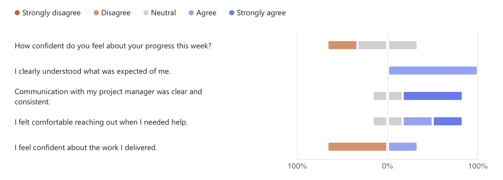

# 🗓️ Weekly Report – Week of April 22–25, 2025

## 1. Overview

This report summarizes team progress, challenges, and plans for the Wine & Cheese Pairing Web Application project based on the internal survey responses collected during the week of April 22–25, 2025.  
The purpose is to promote transparency, highlight overall team sentiment, and outline the next steps.

---

## 2. Highlights (Team Accomplishments)

- Progress made on early Figma mockup preparation.
- Initial onboarding and learning of Bubble.io platform begun.
- Alignment on initial project scope and understanding of client demands.

---

## 3. Challenges / Blockers

- The team encountered a natural learning curve associated with mastering Bubble.io.
- Some challenges were noted regarding access to detailed client-provided product data, which impacted mockup completeness.
- A desire for greater workflow autonomy was expressed to improve individual efficiency and maintain project momentum.

---

## 4. Focus for Next Week

- Finalize and deliver the first round of Figma mockups for internal and client review.
- Continue technical exploration and validation on Bubble.io.
- Begin the first draft of the Functional Specification based on confirmed design and feature expectations.

---

## 5. Team Confidence Summary

The following graph summarizes team responses regarding progress confidence, clarity of expectations, communication quality, and overall comfort in reaching out for help:

| Survey Aspect | Team Sentiment |
|:--------------|:---------------|
| Progress Confidence | Mixed to positive (some uncertainty during onboarding) |
| Clarity of Expectations | Generally clear |
| Communication with Project Management | Strong and consistent |
| Support & Collaboration | Positive with small opportunities for better workflow autonomy |
| Focus & Productivity | Good overall, with minor attention challenges noted |

---

## 6. Key Feedback Themes

- The team would benefit from regular and brief clarifications regarding evolving feature expectations.
- Prioritizing simple and efficient content management for future employee users should remain a key design focus.
- Promoting autonomy and reducing unnecessary workflow interruptions will further enhance productivity.

---

## 7. Overall Observations

The team is progressing steadily, balancing the dual challenges of design work and onboarding with new technical tools.  
While some natural friction points exist, team sentiment remains constructive and solutions-focused.  
The next key milestone remains delivery of mockups by May 5th, which will solidify the project direction and support the upcoming drafting of functional and technical specifications.

---

## 8. Conclusion

The team remains motivated and focused on advancing the project according to the defined timeline.  
Efforts are currently concentrated on developing high-quality prototypes that will be presented to the client for validation.  
This iterative approach will ensure alignment with client expectations, establish a clear project scope, and lay a solid foundation for subsequent development phases.
