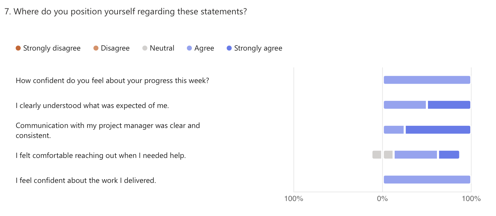

# 🗓️ Weekly Report - Week of April 28-May 2, 2025

## 1. Overview

This report summarizes team progress, blockers, and next steps for the Wine & Cheese Pairing Web Application project based on internal survey responses collected during the week of April 28-May 2, 2025.  
It aims to support transparency, reflect on team sentiment, and maintain alignment on priorities.

---

## 2. Highlights (Team Accomplishments)

- Completion and refinement of the first round of mockups using Figma.
- Initial content curation of wine and cheese descriptions, structured to improve clarity and a clean data structure in the data base.
- Early logic implementation in Bubble, including JavaScript components and initial data handling structure.

---

## 3. Challenges / Blockers

- Some team members are still navigating the learning curve of using Figma and adapting to collaborative design workflows.
- Motivation and focus dips were briefly mentioned but did not significantly impact output.
- Dependencies on team discussions for design decisions caused minor pacing variations.

---

## 4. Focus for Next Week

- Final adjustments and delivery of mockups for review and client validation.
- Begin formal drafting of the Functional Specification based on finalized design direction.
- Expand technical validation within Bubble, including connecting mockups to data flows and logic.

---

## 5. Team Confidence Summary

Survey results indicate a **generally confident and positive outlook**, with most team members reporting strong clarity on expectations, comfort in communication, and increasing confidence in their contributions.

| Survey Aspect | Team Sentiment |
|:--------------|:---------------|
| Progress Confidence | Positive and consistent |
| Clarity of Expectations | Strong alignment |
| Communication with Project Management | Clear and supportive |
| Collaboration & Support | Positive, with praise for team spirit |
| Focus & Productivity | Good, with minor mentions of distraction or pacing dips |

---

## 6. Key Feedback Themes

- Team members expressed **satisfaction with management approach and team spirit**, describing the atmosphere as encouraging.
- Requests for **autonomy in coding and strategy** indicate growing ownership of responsibilities.
- Emphasis on the need for tools and features that deliver actual value to end-users (Intermarché customers).

---

## 7. Overall Observations

The team is entering a productive rhythm, with clarity increasing and early deliverables starting to take shape. Design tasks are nearing completion, and development is beginning to ramp up. Morale is strong, and team members are engaging thoughtfully with the product vision.

Notably, no overtime was reported this week, and all contributors were aligned on the project’s scope and purpose.

---

## 8. Conclusion

The team is well-positioned for the upcoming milestone: delivering validated mockups and transitioning into early application logic development. With no significant blockers reported and strong team sentiment, the project remains on track both in timeline and quality. Continued communication and structured iteration will support smooth progress into the next phase.