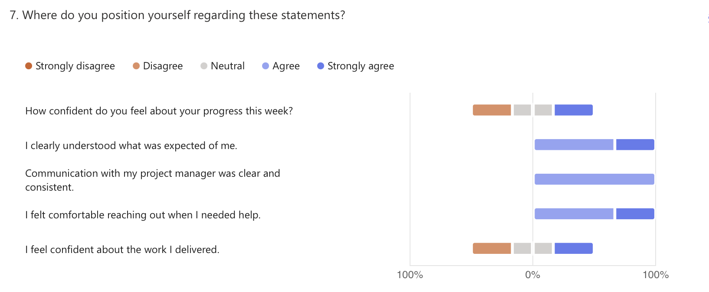

# 🗓️ Weekly Report - Week of May 5-9, 2025

## 1. Overview

This report summarizes team progress, blockers, and next steps for the Wine & Cheese Pairing Web Application project based on internal survey responses collected during the week of May 5-9, 2025.  
It aims to promote transparency, highlight team momentum, and align priorities moving into the next development phase.

-

## 2. Highlights (Team Accomplishments)

- Completion of the final mockup package for the client, and successful handoff for feedback.
- Development of the initial wine and cheese information pages in Bubble, covering key content structure.
- Creation of a JavaScript-based CSV uploader for adding wine entries into the Bubble database.
- AI-assisted data generation initiated to support scalable population of wine metadata.

-

## 3. Challenges / Blockers

- Limited work time for some team members due to the shortened week.
- Difficulties with Bubble’s responsive mode and UI logic caused slowdowns in layout building.
- Workarounds were needed to write to the Bubble database via JavaScript due to platform constraints.
- Uncertainty around next-week feature priorities was raised by a developer.

-

## 4. Focus for Next Week

- Finalize wine and cheese content population and structure it within the Bubble database.
- Improve dynamic page logic and enhance responsiveness across views.
- Establish a clear internal feature assignment roadmap and development sequence.
- Finalize the functional specification based on validated mockup features.

-

## 5. Team Confidence Summary

Team confidence remains **steady to positive**, though varied. Most members reported high clarity and strong communication, though slight uncertainty was expressed around next steps and task distribution.

| Survey Aspect | Team Sentiment |
|:-|:-|
| Progress Confidence | Mixed - ranged from low to high based on workload |
| Clarity of Expectations | Generally clear, with one request for clearer next steps |
| Communication with Project Management | Positive and consistent |
| Collaboration & Support | Strong willingness to help, but occasional UI support needed |
| Focus & Productivity | Solid for most, though time constraints affected one member |

-

## 6. Key Feedback Themes

- The team remains proactive and supportive, with a strong openness to collaboration.
- There is a desire for **greater clarity in upcoming individual task assignments**, particularly for development.
- Technical creativity was leveraged to overcome Bubble limitations, demonstrating problem-solving mindset.
- One member reported working overtime (3-5 hours) to meet data preparation goals - not team-wide, but worth monitoring.

-

## 7. Overall Observations

Despite a shorter work week, the team continued to deliver key components and push forward on both development and data integration. Technical ownership is growing, and problem-solving around platform constraints is progressing effectively. Maintaining pace will now depend on tighter task scoping and timely handoff of the client's mockup feedback.

-

## 8. Conclusion

The team remains motivated and resourceful, with progress well-aligned to the roadmap.  
Clearer weekly objectives and focused task assignment are key priorities to ensure development moves forward efficiently. Feedback from Intermarché in the coming days will shape the next sprint and drive the transition into more structured implementation work.