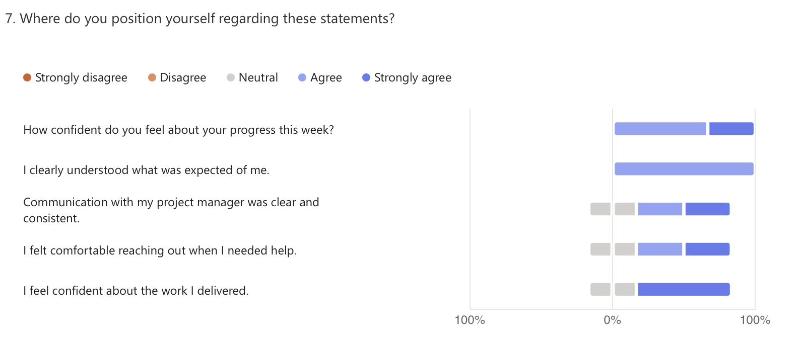

# 🗓️ Weekly Report - Week of May 12-16, 2025

## 1. Overview

This report summarizes progress, blockers, and next steps for the Wine & Cheese Pairing Web Application project based on team responses collected during the week of May 12-16, 2025.  
The team has now transitioned from design and planning into focused development and data integration efforts.

---

## 2. Highlights (Team Accomplishments)

- Finalization of the Functional Specification document.
- Completion of the wine and cheese information pages with dynamic data integration.
- Creation of the landing page structure.
- Final population and refinement of the wine database, including the backend logic for wine selection.

---

## 3. Challenges / Blockers

- Some ongoing difficulty with **Bubble’s responsive design system**, especially when building layout components.
- Time constraints due to the **late scheduling of the client meeting**.
- Technical fine-tuning was needed to prevent the wine selection logic from producing misleading results (irrelevant or false recommendations).

---

## 4. Focus for Next Week

- Completion and testing of the landing page and frontend logic.
- Integration of wine-food pairing logic into Bubble using the new data structure.
- Begin implementing filtering based on **occasion**, **price range**, and **dish type**.
- Continue developing the cheese logic and integrate guidance received from the client meeting.

---

## 5. Team Confidence Summary

The team reported **steady and mostly positive confidence**, with strong alignment on deliverables. While some uncertainties remain around individual next steps (notably for the cheese page), overall communication and task understanding remain strong.

| Survey Aspect | Team Sentiment |
|:--------------|:---------------|
| Progress Confidence | Moderate to High |
| Clarity of Expectations | Mostly clear |
| Communication with Project Management | Consistent and effective |
| Collaboration & Support | Strong, with occasional need for UI-specific help |
| Focus & Productivity | Good overall, minor distractions noted |

---

## 6. Key Feedback Themes

- The team is gaining technical fluency with Bubble, though responsiveness remains a common hurdle.
- There is interest in clarifying the expected scope and content for the cheese section.
- The AI integration process is proving powerful but requires careful tuning to ensure reliability.
- One team member reported working 1-2 extra hours to complete database-related tasks; no major overtime was reported.

---

## 7. Overall Observations

This week marked a confident shift into development, with foundational pages and logic now functional. The team has responded well to the client’s feedback and continues to iterate on real-world logic provided during the meeting. A few refinements remain to fully align functionality with design, but the project remains on track and cohesive.

---

## 8. Conclusion

The transition from planning to structured execution is well underway.  
With core logic now in place and additional filtering features set for the upcoming sprint, the project is progressing as expected. Attention will now turn to polishing the user experience and implementing final key decision flows before user testing and client review.