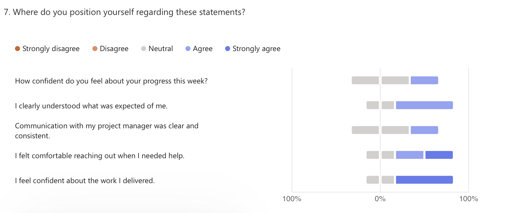

# 🗓️ Weekly Report - Week of May 19-23, 2025

## 1. Overview

This report summarizes the team’s progress, challenges, and next steps for the Wine & Cheese Pairing Web Application project, based on survey responses collected during the week of May 19-23, 2025.  
The team is in the midst of development, with key modules beginning to take shape, while deeper feedback from the client meeting continues to inform technical and functional decisions.

---

## 2. Highlights (Team Accomplishments)

- Completion of the first version of the **Technical Specifications**.
- Progress on the **Wine Visualizer**, including wine selection and result screens.
- Initial implementation of **multilingual support**, using a custom solution to bypass Bubble’s limitations with dynamic text.
- Continued editing and refinement of the **Functional Specification**.
- Improved understanding of the project scope for some team members following the client meeting on May 17.

---

## 3. Challenges / Blockers

- Persistent issues with **Bubble's responsive engine** continue to slow down UI development.
- The lack of a native multilingual system in Bubble required a **custom-built workaround**, adding to the development load.
- A degree of **uncertainty around the next task** was mentioned by one developer.

---

## 4. Focus for Next Week

- Begin implementing the **wine selection algorithm**, including filtering and search bar functionality.
- Integrate **cheese logic**, based on feedback gathered during the meeting with the wine and cheese department managers.
- Final polish and delivery of both **functional and technical specification documents**.
- Continue front-end layout refinements and improve page responsiveness.

---

## 5. Team Confidence Summary

This week’s results show a **mixed but improving confidence level**. While technical progress is advancing steadily, some doubts remain around focus, clarity of scope, and internal coordination.

| Survey Aspect | Team Sentiment |
|:--------------|:---------------|
| Progress Confidence | Moderate and varied |
| Clarity of Expectations | Improving, but still uneven |
| Communication with Project Management | Clear and consistent |
| Collaboration & Support | Generally positive |
| Focus & Productivity | Mixed; some distraction noted |

---

## 6. Key Feedback Themes

- The meeting with Célia and the department managers was described as **very helpful** by some team members, as it simplified and clarified the expected logic for the recommendation system.
- Requests were made for **more familiar or interest-aligned tasks**, as well as increased autonomy in proposing page or UX improvements.
- One member worked **3-5 extra hours** to catch up on previously delayed work and finalize functionality.
- Overall, the team is showing increasing **ownership and critical thinking**, with technical creativity emerging in response to platform limitations.

---

## 7. Overall Observations

The team is navigating development challenges with resilience and creativity. While some gaps in focus or clarity persist, progress is being made across both documentation and feature implementation. Feedback from the recent client meeting has helped ground the team in practical application logic, which will support the next development sprint.

---

## 8. Conclusion

The project remains on track, though continued attention is needed to ensure alignment and prioritization across roles. With upcoming work focused on filtering logic, cheese integration, and responsiveness improvements, the team is preparing to deliver a strong, testable version of the application. Strong internal coordination and adherence to scope will be key for success in the coming weeks.