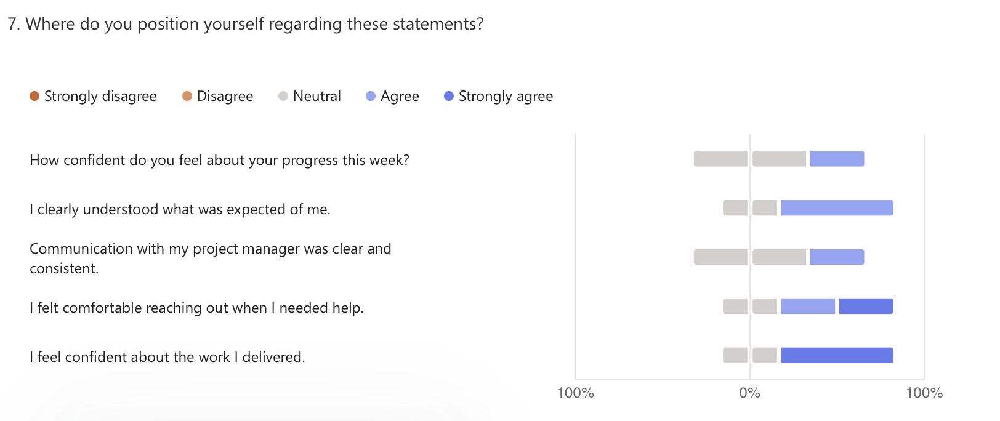

# 🗓️ Weekly Report - Week of June 3-7, 2025

## 1. Overview

This report summarizes team activity, progress, and blockers for the Wine & Cheese Pairing Web Application during the week of June 3–7, 2025.  
The week was focused on making the application more dynamic, continuing database population, refining documentation, and preparing the platform for client testing and the final presentation.

---

## 2. Highlights (Team Accomplishments)

- Made progress on the **cheese-related pages**, adding dynamic behaviors and UI assets.
- Continued **filling and refining the cheese database**, including difficulty sourcing relevant imagery.
- Refined **UX/UI across various components**, improving usability for testing and presentation.
- Documentation and project materials were reviewed and updated for alignment with current features.
- Proofreading and polishing of the **Technical Specification** document.

---

## 3. Challenges / Blockers

- Difficulty locating **relevant wine imagery**.
- Some hesitation in progress tracking, with one member requesting clearer **guidance on expectations**.

---

## 4. Focus for Next Week

- Finalize **cheese-related logic** and dynamic components.
- Implement **association algorithms** between wines and cheeses (including by type).
- Continue polishing and aligning UX/UI for testability and presentation clarity.
- Begin preparation of **oral presentation structure** and speaking roles.

---

## 5. Team Confidence Summary

Overall confidence was moderate, with team members continuing to deliver despite minor clarity concerns.  
Technical direction remained stable, though requests for coordination on oral prep and workload balance began to emerge.

| Survey Aspect                  | Team Sentiment                       |
|-------------------------------|--------------------------------------|
| Progress Confidence           | Moderate and steady                  |
| Clarity of Expectations       | Mixed (some uncertainty reported)    |
| Communication with PM         | Neutral to positive                  |
| Comfort Reaching Out          | Generally adequate                   |
| Focus & Productivity          | Balanced, with room for coordination |
| Collaboration & Support       | Stable, with mild fluctuation        |

---

## 6. Key Feedback Themes

- One team member requested earlier planning regarding **oral presentation roles**, to balance their schedule with other academic deliverables.
- Requests for clearer validation and **check-ins from PM** to track individual contributions more closely.
- Overall collaboration remains strong, and documentation efforts are now aligned with development.

---

## 7. Overall Observations

The team is progressing through final refinements with functional pages being implemented and tested.  
Cheese content and UI elements have been brought closer to completion, while documentation is up-to-date. Attention now begins to shift toward **oral presentation readiness** and ensuring the app is fully client-usable.

---

## 8. Conclusion

Development is approaching completion, with documentation and feature coverage aligning well.  
With a few remaining logic flows and front-end enhancements left to polish, the team is moving into the final stretch. Oral presentation coordination and client testing preparation will be the focus going forward.