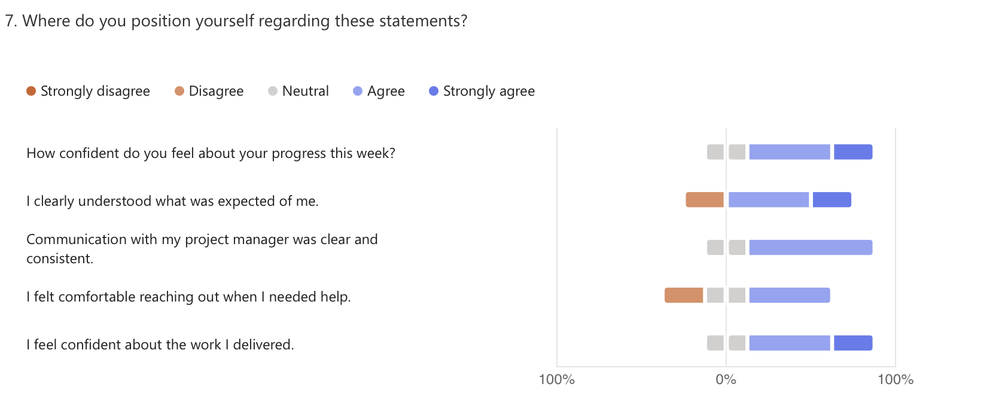

# 🗓️ Weekly Report - Week of June 10-14, 2025

## 1. Overview

This report summarizes team activity, blockers, and upcoming goals for the Wine & Cheese Pairing Web Application during the week of June 10–14, 2025.  
With the application feature set nearing completion, the team focused this week on refining UI elements, resolving bugs, and preparing content and structure for the final oral presentation.

---

## 2. Highlights (Team Accomplishments)

- Finalized **cheese selection form** on the frontend.
- Continued refinement of the **Wine Visualizer**, including the addition of **garnishment icons** and UI adjustments.
- Fixed bugs related to **device-specific UI behavior** and **linked wine-cheese associations** in the database.
- Ongoing updates to project documentation in preparation for the final defense.

---

## 3. Challenges / Blockers

- **Bubble platform limitations** (especially with JavaScript integration and framework behaviors) slowed implementation of some logic.
- **Inconsistent behavior across devices** created additional testing and debugging overhead.
- One team member reported occasional issues with clarity in communication.

---

## 4. Focus for Next Week

- Final preparation and **rehearsal of the oral presentation**.
- Last round of bug fixes and UI polishing across form and visual components.
- Ensure platform stability and presentation readiness on multiple devices.

---

## 5. Team Confidence Summary

Overall confidence remains strong, with continued motivation and clarity on the project's goals.  
Some minor friction was noted in platform responsiveness and communication, but the team continues to deliver on expectations.

| Survey Aspect                  | Team Sentiment                        |
|-------------------------------|---------------------------------------|
| Progress Confidence           | Positive and stable                   |
| Clarity of Expectations       | Clear for most members                |
| Communication with PM         | Generally consistent                  |
| Comfort Reaching Out          | Good, with minor feedback on attention |
| Focus & Productivity          | Mostly steady, with external factors noted |
| Collaboration & Support       | Maintained across roles               |

---

## 6. Key Feedback Themes

- The **oral presentation** has become a shared focus and team members feel aligned on its structure.
- Bubble’s limitations continue to be a source of frustration for development, especially when customizing interactions.
- Team feedback highlights a desire for more attentiveness during collaboration.

---

## 7. Overall Observations

With the core functionality implemented, the project has entered a **final refinement phase**.  
Bug fixing, device-specific UI adjustments, and narrative preparation for the final demo are now top priorities. Despite minor obstacles, the team has maintained forward momentum and continues to demonstrate ownership of their respective areas.

---

## 8. Conclusion

The project is approaching delivery with most core components complete.  
Attention is now focused on polish, performance, and clear presentation of the product's value during the upcoming final defense.  
The team remains focused and committed to delivering a reliable and functional tool that reflects both client expectations and technical learning.