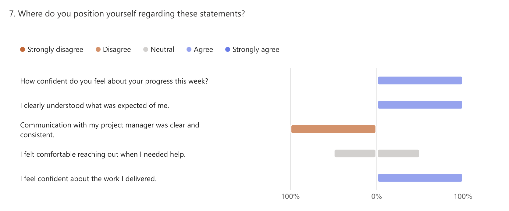

# 🗓️ Weekly Report - Week of June 17-21, 2025

## 1. Overview

This report captures final reflections and contributions during the closing days of the Wine & Cheese Pairing Web App project.  
With development complete and presentation day approaching, this week was focused on preparing for the oral defense and final rehearsals.

---

## 2. Highlights (Team Accomplishments)

- Final oral **presentation rehearsals** began.
- Developer contributions transitioned into **presentation readiness** and script preparation.
- Overall project wrap-up entered its final stage with no new development tasks scheduled.

---

## 3. Challenges / Blockers

- Some logistical challenges due to **team member absences**.
- No technical blockers were reported, but **coordination** for the oral presentation was impacted slightly.

---

## 4. Focus for Next Week

- Deliver the **final client and jury presentation**.
- Close out all project documentation and submissions.
- Provide final client-ready assets and presentation-ready demo walkthrough.

---

## 5. Team Confidence Summary

Confidence remained steady and high, though one respondent noted a desire to be **notified quickly** in case last-minute adjustments were needed.

| Survey Aspect                  | Team Sentiment                  |
|-------------------------------|---------------------------------|
| Progress Confidence           | Positive                        |
| Clarity of Expectations       | Clear                           |
| Communication with PM         | Mostly consistent               |
| Comfort Reaching Out          | Acceptable                      |
| Focus & Productivity          | Balanced despite distractions   |
| Collaboration & Support       | Lower this week due to absences |

---

## 6. Key Feedback Themes

- A request for better **notification of changes** was noted.
- The transition from dev to presentation went smoothly for at least one member.
- Light humor and positivity remained part of the team atmosphere, even in the final stretch.

---

## 7. Overall Observations

This week marked the close of an intense development cycle.  
With the final product completed, team members focused on preparing for the final presentation and ensuring the work is communicated clearly to the client and jury.  
Despite some attendance gaps, morale remains positive and the team is ready for delivery.

---

## 8. Conclusion

The project has reached its final milestone.  
Oral presentation efforts are now the primary focus, and the product is complete.  
All indicators suggest the team is prepared to showcase their work effectively and close the project on a strong note.