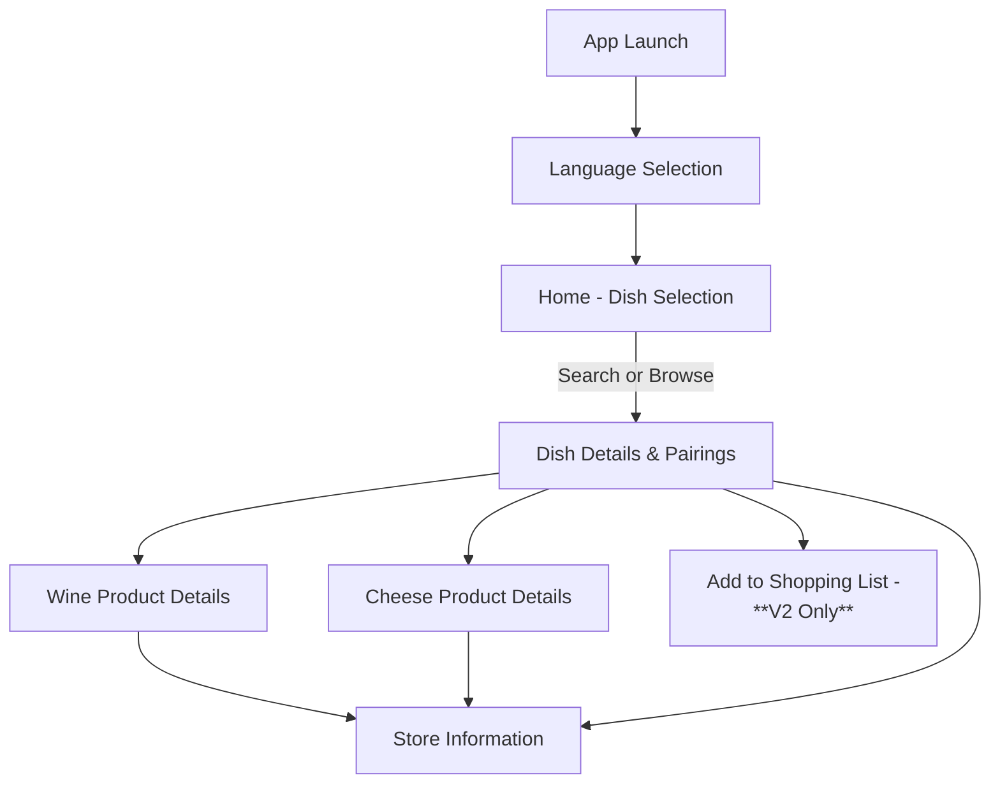
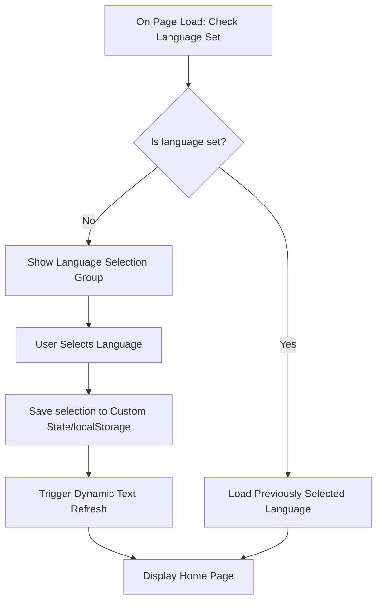
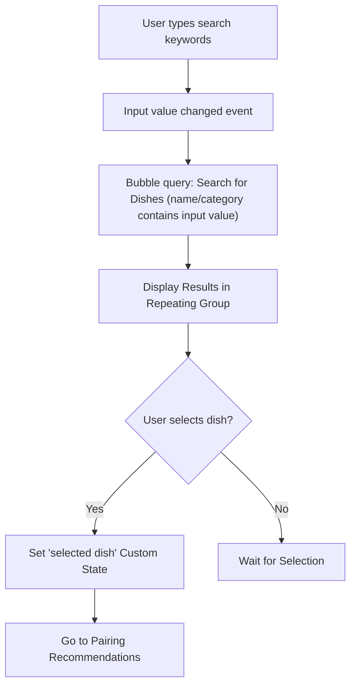
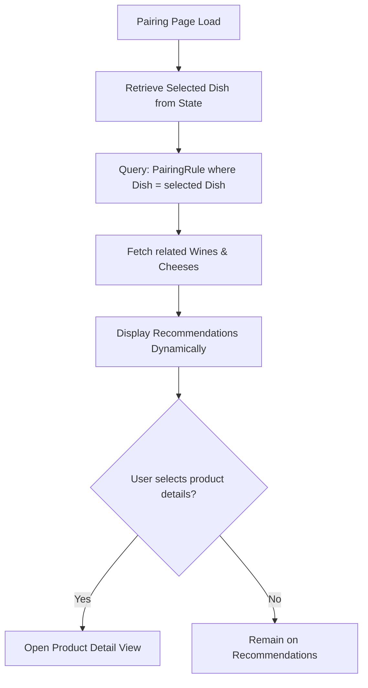
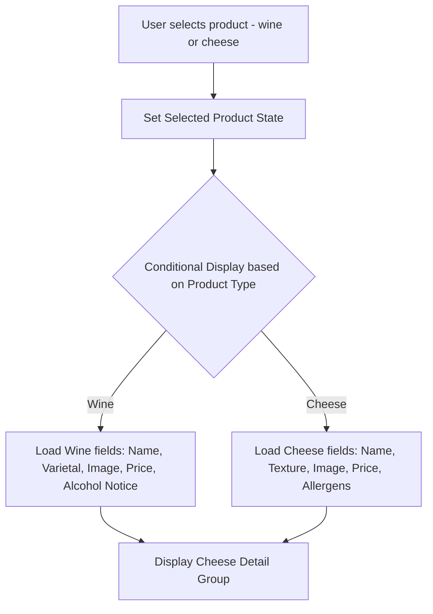
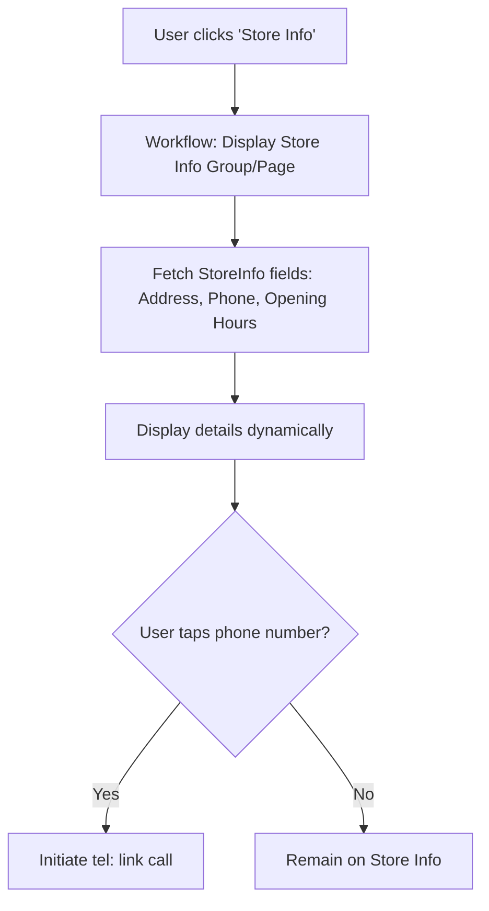
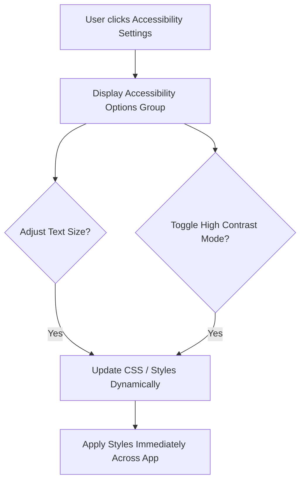
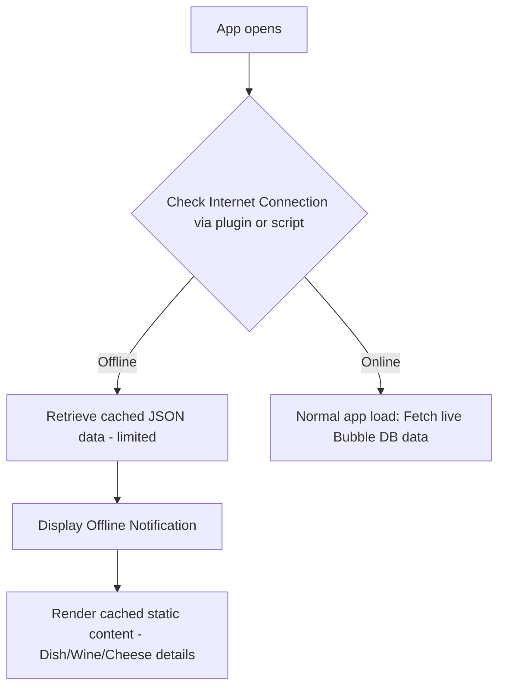

# 🧾 Technical Specification – Intermarché Wine & Cheese Pairing App

**Project Name:** Intermarché Wine & Cheese Pairing App  
**Version:** 1.0  
**Prepared By:** Rémy Charles 
**Date:** 2025-05-20  
**Platform:** Bubble (No-Code)  
**Application Type:** Mobile-First Progressive Web App (PWA)  
**Target Audience:** Tourists & Local Shoppers in Southern France

---

## 📑 Table of Contents

1. [Technical Overview](#technical-overview)
2. [App Architecture](#app-architecture)
3. [Database Model](#database-model)
4. [Workflows & Logic](#workflows--logic)
5. [Multilingual Implementation](#multilingual-implementation)
6. [User Interface & Accessibility](#user-interface--accessibility)
7. [Performance Optimization](#performance-optimization)
8. [Security & Compliance](#security--compliance)
9. [Plugins & Integrations](#plugins--integrations)
10. [Limitations & Assumptions](#limitations--assumptions)

---

## 1. Technical Overview

### 1.1 Purpose of the Application

The application is a mobile-first Progressive Web App (PWA) built with **Bubble**, designed to help users find ideal **wine and cheese pairings** for a selected dish. The app serves customers of a specific Intermarché store in Southern France, with a primary focus on tourists and non-expert users unfamiliar with local products. It aims to improve the in-store experience, support local gastronomy, and increase product visibility without requiring user accounts or complex interactions.

---

### 1.2 Development Platform

- **Platform**: [Bubble](https://bubble.io) – a visual, no-code application builder
- **Application Type**: Mobile-responsive PWA
- **Deployment**: Web application accessible via QR code or direct link, with installable "Add to Home Screen" functionality on mobile browsers (PWA)
- **No-code architecture**: All workflows and data are managed through Bubble’s visual editor; no backend coding or native modules

---

### 1.3 Scope (Version 1)

- Bilingual interface: **French** and **English**
- No authentication or user account system
- Core features available offline (static content)
- Features included:
  - Language selection
  - Dish selection (browse and search)
  - Wine and cheese pairing recommendations
  - Product information (taste profile, origin, allergen info, legal notices)
  - Basic store information (hours, contact)
- Features excluded (reserved for future versions):
  - Shopping list
  - Real-time stock availability
  - Store aisle mapping
  - Admin interface
  - User history or personalized recommendations

---

### 1.4 Supported Platforms

- **iOS**: Safari, iOS 15 and above
- **Android**: Chrome, Android 8.0 (API level 26) and above
- **Desktop** (secondary support): Chrome, Safari, Firefox (limited optimization)
- **Optimized for**: Mobile portrait view, touch interface, one-handed usage

---

### 1.5 Key Technical Constraints

- No full offline mode due to Bubble’s limitations; only static content is cached
- No real-time inventory integration in V1
- No external admin panel: product updates must be made directly via the Bubble editor
- Bubble performance considerations require optimization of database searches and workflows
- Cannot access native device features like camera or barcode scanner (without wrapping)

---

### 1.6 Target Users

- Tourists visiting Southern France unfamiliar with local food and wine
- Local French customers seeking inspiration or guidance
- Elderly users and those with limited technical literacy
- Users with accessibility needs, including visual impairments

---

### 1.7 Regulatory & Brand Constraints

- Compliance with **French alcohol advertising laws** (display age-related notices for wine)
- Mandatory display of **allergen information** for all cheese products
- Adherence to **Intermarché brand and UI guidelines** (as provided by store)
- Language must reflect **regional culinary terminology** in French and **international clarity** in English

---

## 2. App Architecture

### 2.1 Pages & Navigation Structure

The app is designed as a **mobile-first Progressive Web App (PWA)**, built using **Bubble's page and reusable element system**. It will follow a **Single Page Application (SPA)** logic using conditional groups and custom states to optimize performance and ensure smooth transitions between views.

---

#### Main Pages / Views

| View / Group | Description |
|--------------|-------------|
| **Language Selector** | First screen shown on launch. Allows the user to choose between French and English. Language preference is stored locally and reused in future sessions. |
| **Home / Dish Selection** | Central hub of the app. Users can search or browse dishes via categories (cuisine, course, etc.). |
| **Pairing Recommendations** | After selecting a dish, this view displays recommended wine and cheese pairings, with explanations and alternative suggestions. |
| **Product Detail (Wine or Cheese)** | View with detailed product info: name, image, region, taste/texture profile, price range, and legal notices (alcohol or allergens). |
| **Store Info** | A simple view showing store opening hours, holiday exceptions, address, and contact phone number. |
| **(V2) Shopping List** | Local-only list stored on the device. Allows adding/removing wines or cheeses, editing quantities, and sharing via native device sharing. |

---

### 2.2 Navigation Flow

Navigation will be managed using **Bubble’s custom states and conditionally visible groups** to simulate multi-page behavior:

### 2.2 Navigation Flow

**Detailed navigation description:**

- **App Launch → Language Selection**  
  Users initially select their preferred language, which is persisted using browser storage or Bubble’s custom states.

- **Language Selection → Home/Dish Selection**  
  This screen is the main interaction point, allowing users to search or browse dishes by category, cuisine, or popularity.

- **Dish Selection → Pairing Recommendations**  
  Selecting a dish triggers display of pairing recommendations (typically 2-3 wines and 2-3 cheeses). Each recommendation includes brief explanations of why the pairing was chosen.

- **Pairing Recommendations → Product Detail Views**  
  Users can select a wine or cheese to view detailed information such as taste profiles, regions of origin, allergen warnings, legal disclaimers for wines, and price indicators.

- **Product Details → Store Information**  
  At any point, users can quickly access store-specific information, including address, phone number, and regular or exceptional opening hours.

- **Pairing Recommendations → Add to Shopping List (V2)**  
  In future updates, users will be able to add items directly to a shopping list, saved locally without requiring account creation.

---

### 2.3 Data Handling and Storage

- **No User Accounts**:  
  There is no login or account management system. Data remains session-based or stored locally in browser storage.

- **Persistent Language Selection**:  
  The user's language preference is stored persistently in browser local storage, ensuring consistent experience across sessions.

- **Local Storage for Shopping List (V2 only)**:  
  In the planned V2 version, user shopping lists will be stored locally on the device without database persistence or user authentication.

---

### 2.4 Offline Capabilities

- Static content (such as product descriptions, images, and pairing information) can be cached using browser-level storage or through available Bubble plugins to ensure basic functionality during intermittent connectivity.

- Features relying on dynamic data (future real-time stock information or live updates) will require an active internet connection and will degrade gracefully in offline conditions.

---

### 2.5 External Integrations (Future Considerations)

Possible future integrations include:
- Real-time inventory updates (direct integration with the store's inventory system)
- Barcode scanning for additional product details (only feasible with native app wrappers)
- Enhanced multilingual support through Bubble plugins for additional languages beyond French and English (e.g., Spanish, German, Italian).

---

### 2.6 Accessibility Guidelines

The app strictly adheres to accessibility standards designed for:
- **Elderly users** (large, easily tappable buttons, clear typography)
- **Colorblind users** (use of accessible color palettes, avoiding critical information conveyed solely through color)
- **Visually impaired users** (scalable font sizes, clear and consistent iconography)

---

## 3. Database Model (Bubble Data Types)

This section details the structure of the internal Bubble database, defining clearly the data types and fields required for the app functionality.

### 3.1 Dish

| Field Name   | Type  | Description                                              |
|--------------|-------|----------------------------------------------------------|
| `name`       | Text  | Dish name (e.g., "Cassoulet")                            |
| `image`      | Image | Representative image of the dish                         |
| `category`   | Text  | Category for browsing (cuisine, meal type, cooking style)|
| `description`| Text  | Optional short description of the dish                   |
| `slug`       | Text  | URL-friendly identifier for navigation                   |

---

### 3.2 Wine

| Field Name      | Type    | Description                                          |
|-----------------|---------|------------------------------------------------------|
| `name`          | Text    | Wine label or product name                           |
| `region`        | Text    | Wine region (e.g., "Bordeaux")                       |
| `varietal`      | Text    | Type of grape (e.g., "Merlot")                       |
| `taste_profile` | Text    | Description of wine flavor (e.g., "Dry, fruity")     |
| `price`         | Number  | Numeric price value (EUR)                            |
| `image`         | Image   | Image of the wine bottle                             |
| `legal_notice`  | Yes/No  | Alcohol legal age disclaimer (always "Yes")          |

---

### 3.3 Cheese

| Field Name       | Type          | Description                                     |
|------------------|---------------|-------------------------------------------------|
| `name`           | Text          | Cheese name (e.g., "Roquefort")                 |
| `region`         | Text          | Cheese origin region                            |
| `texture`        | Text          | Texture description (e.g., "Soft", "Hard")      |
| `flavor_profile` | Text          | Taste profile (e.g., "Sharp, nutty")            |
| `price`          | Number        | Numeric price value (EUR)                       |
| `image`          | Image         | Representative cheese image                     |
| `allergens`      | List of Texts | List of allergens (e.g., ["Milk", "Lactose"])   |

---

### 3.4 PairingRule

| Field Name    | Type            | Description                                      |
|---------------|-----------------|--------------------------------------------------|
| `dish`        | Dish            | Associated dish                                  |
| `wines`       | List of Wines   | Recommended wines (2-3 options)                  |
| `cheeses`     | List of Cheeses | Recommended cheeses (2-3 options)                |
| `explanation` | Text            | Explanation of pairing rationale                 |

---

### 3.5 StoreInfo

| Field Name           | Type | Description                                          |
|----------------------|------|------------------------------------------------------|
| `name`               | Text | Store name                                           |
| `address`            | Text | Store address (full address)                         |
| `phone_number`       | Text | Contact number                                       |
| `opening_hours`      | Text | Weekly opening hours                                 |
| `holiday_exceptions` | Text | Special opening hours during holidays                |

---

### 3.6 Translation *(Optional if using plugin)*

| Field Name | Type | Description                                  |
|------------|------|----------------------------------------------|
| `key`      | Text | Translation key (e.g., "button_submit")      |
| `french`   | Text | French translation                           |
| `english`  | Text | English translation                          |

---

> **Note**: The Translation type is optional if choosing Bubble’s multilingual plugin instead.

---

## 4. User Workflows

This section outlines the core user workflows that will be built visually using Bubble's workflow editor. Each workflow describes user actions and corresponding system responses.

---

### 4.1 Language Selection Workflow

**Trigger**: User opens the app (first time)

**Technical Steps (Bubble Implementation):**

- On initial page load, check if language is already set (using local storage or custom states).
- If no language is set, display the language selection interface.
- User selects "French" or "English":
  - Save selection in Bubble’s custom state or browser local storage.
  - Dynamically update displayed text throughout the app based on chosen language.
- Navigate user to home page after selection.

> **Note**: Language selection persists across sessions unless changed by user.

---

### 4.2 Dish Search Workflow

**Trigger**: User enters search keywords or selects browsing categories

**Technical Steps:**

- User inputs text into the search field:
  - Trigger Bubble workflow on input value change or search button click.
- Bubble performs dynamic "Search for Dish" query (filter by `name` or `category` contains search input).
- Results populate dynamically within a repeating group.
- User selects a dish from results:
  - Set selected dish into a custom state.
  - Navigate user to the pairing recommendations page or dynamically load pairing group.

---

### 4.3 Pairing Recommendations Workflow

**Trigger**: User views recommended pairings for a selected dish

**Technical Steps:**

- Retrieve selected `Dish` from custom state.
- Execute Bubble query: "Search for PairingRule" where `PairingRule.dish` matches selected dish.
- Retrieve associated `Wine` and `Cheese` records from PairingRule.
- Dynamically display the wines and cheeses along with their pairing explanations.
- User selects product details:
  - Set selected `Wine` or `Cheese` in custom state.
  - Show detailed product information group or pop-up.

---

### 4.4 Product Detail View Workflow (Wine & Cheese)

**Trigger**: User selects a wine or cheese from recommendations

**Technical Steps:**

- Identify type of selected product (Wine or Cheese) via Bubble’s conditional logic.
- Dynamically load and display respective product fields:
  - **Wine**: Name, image, varietal, region, price, taste profile, alcohol legal disclaimer.
  - **Cheese**: Name, image, region, texture, flavor profile, allergens, price.
- Allow user to return easily to pairing recommendations via a clearly marked navigation control.

---

### 4.5 Store Information View Workflow

**Trigger**: User accesses store info via menu or footer link

**Technical Steps:**

- Upon click event on the "Store Info" button or menu link:
  - Bubble retrieves data directly from the `StoreInfo` data type.
  - Display store details dynamically: address, contact phone number, opening hours, special holiday schedule.
- Contact phone number is formatted as a clickable link for initiating calls directly from mobile devices.

---

### 4.6 Accessibility Workflow (Optional)

**Trigger**: User adjusts accessibility options (if implemented)

**Technical Steps:**

- User opens accessibility settings panel.
- User adjusts available settings:
  - Text size (small, medium, large).
  - High contrast mode toggle.
- Bubble dynamically applies CSS or conditional styling changes instantly across the application UI.
- Persist settings choice in browser local storage or Bubble’s custom states for continued sessions.

---

### 4.7 Offline Data Workflow (Basic Implementation)

**Trigger**: User opens app without internet connection

**Technical Steps:**

- On app load, perform internet connectivity check using Bubble-compatible plugins or JavaScript snippets.
- If offline:
  - Retrieve cached data (JSON objects stored previously in local storage).
  - Display an offline status notification to inform the user clearly ("You are offline. Showing previously loaded content").
  - Render static data from cache: limited details of dishes, wines, cheeses, and previously viewed pairings.
- If online:
  - Perform standard Bubble workflow to fetch and display live data from the Bubble database.

> **Note**: Bubble's offline capabilities are limited; ensure only essential static data is cached locally.

---