<!-- PROJECT LOGO -->
<br />
<div align="center">
  <h1 align="center">Technical Specification</h1>
  <p align="center">
    <strong>Intermarché Wine & Cheese Pairing App</strong>
    <br />
  </p>
</div>

</br>

**Project Name:** Intermarché Wine & Cheese Pairing App  </br>
**Version:** 1.0  </br>
**Prepared By:** Rémy Charles </br>
**Date:** 2025-05-20  </br>
**Platform:** Bubble[¹](#glossary-bubble) (No-Code)  </br>
**Application Type:** Mobile-First Progressive Web App (PWA[²](#glossary-pwa)) </br> 
**Target Audience:** Tourists & Local Shoppers in Southern France 

---

## Table of Contents

<details>
<summary><b>I. Technical Overview</b></summary>

**I. [Technical Overview](#i-technical-overview)**  
- [1.1 Purpose of the Application](#11-purpose-of-the-application)  
- [1.2 Development Platform](#12-development-platform)  
- [1.3 Scope (Version 1)](#13-scope-version-1)  
- [1.4 Supported Platforms](#14-supported-platforms)  
- [1.5 Key Technical Constraints](#15-key-technical-constraints)  
- [1.6 Progressive Web App (PWA) Support](#16-progressive-web-app-pwa-support)  
- [1.7 Target Users](#17-target-users)  
- [1.8 Legal, Brand & Content Constraints](#18-legal-brand--content-constraints)

</details>

<details>
<summary><b>II. App Architecture</b></summary> 

**II. [App Architecture](#ii-app-architecture)**  
- [2.1 Application Type](#21-application-type)  
- [2.2 Main Pages / Views](#22-main-pages--views)  
- [2.3 Navigation Logic](#23-navigation-logic)  
- [2.4 Group & Element Hierarchy](#24-group--element-hierarchy-structural-notes)  
- [2.5 Responsive Layout Strategy](#25-responsive-layout-strategy)  
- [2.6 Custom States Summary](#26-custom-states-summary)  
- [2.7 URL Parameter Use](#27-url-parameter-use)  
- [2.8 Error Handling & Fallback Logic](#28-error-handling--fallback-logic)  
- [2.9 App Flow Overview (Diagram)](#29-app-flow-overview-diagram)

</details>

<details>
<summary><b>III. Database Model</b></summary>

**III. [Database Model](#iii-database-model)**  
- [3.1 Overview of Data Entities](#31-overview-of-data-entities)  
- [3.2 Entity Relationships](#32-entity-relationships)  
- [3.3 Entity Relationship Diagram (ERD)](#33-entity-relationship-diagram-erd)  
- [3.4 Sample Dataset](#34-sample-dataset)  
- [3.5 Design Principles](#35-design-principles)  
- [3.6 Future Extensions](#36-future-extensions)  
- [3.7 Optional Data Type: Translation](#37-optional-data-type-translation)  
- [3.8 General Bubble Settings (Data Layer)](#38-general-bubble-settings-data-layer)

</details>

<details>
<summary><b>IV. User Workflows</b></summary>

**IV. [User Workflows](#iv-user-workflows)**  
- [4.1 Language Selection Workflow](#41-language-selection-workflow)  
- [4.2 Dish Search Workflow](#42-dish-search-workflow)  
- [4.3 Pairing Recommendations Workflow](#43-pairing-recommendations-workflow)  
- [4.4 Product Detail View Workflow](#44-product-detail-view-workflow)  
- [4.5 Store Information View Workflow](#45-store-information-view-workflow)  
- [4.6 Accessibility Options (Optional)](#46-accessibility-options-optional)  
- [4.7 Offline Fallback Workflow](#47-offline-fallback-workflow)  
- [4.8 Workflow Summary Table](#48-workflow-summary-table)  
- [4.9 Custom State Lifecycle Summary](#49-custom-state-lifecycle-summary)

</details>

<details>
<summary><b>V. Multilingual Support</b></summary>

**V. [Multilingual Support](#v-multilingual-support)**  
- [5.1 Supported Languages](#51-supported-languages)  
- [5.2 Implementation Options](#52-implementation-options)  
- [5.3 Language Selection & Persistence](#53-language-selection--persistence)  
- [5.4 Usage in Dynamic Text](#54-usage-in-dynamic-text)  
- [5.5 Optimizations for Repeated Translations](#55-optimizations-for-repeated-translations)  
- [5.6 Error Handling & Fallback](#56-error-handling--fallback)  
- [5.7 UI and Design Considerations](#57-ui-and-design-considerations)  
- [5.8 Mermaid Diagram – Custom Language Load Logic](#58-mermaid-diagram--custom-language-load-logic)  
- [5.9 Maintenance & Scaling](#59-maintenance--scaling)

</details>

<details>
<summary><b>VI. Design & Responsiveness</b></summary>

**VI. [Design & Responsiveness](#vi-design--responsiveness)**  
- [6.1 Design Principles](#61-design-principles)  
- [6.2 Page Structure and Layouts](#62-page-structure-and-layouts)  
- [6.3 Bubble Responsive Engine Setup](#63-bubble-responsive-engine-setup)  
- [6.4 Font and Typography](#64-font-and-typography)  
- [6.5 Images and Visual Assets](#65-images-and-visual-assets)  
- [6.6 Responsiveness Across Devices](#66-responsiveness-across-devices)  
- [6.7 Accessibility Features](#67-accessibility-features)  
- [6.8 Layout Fallback Logic](#68-layout-fallback-logic)  
- [6.9 Mermaid Diagram – Responsive Behavior Strategy](#69-mermaid-diagram--responsive-behavior-strategy)

</details>

<details>
<summary><b>VII. Performance Considerations</b></summary>

**VII. [Performance Considerations](#vii-performance-considerations)**  
- [7.1 Performance Targets](#71-performance-targets)  
- [7.2 Bubble Optimization Strategies](#72-bubble-optimization-strategies)  
- [7.3 Image Optimization](#73-image-optimization)  
- [7.4 Offline Behavior Handling](#74-offline-behavior-handling)  
- [7.5 Device & Network Testing](#75-device--network-testing)  
- [7.6 Debugging & Profiling](#76-debugging--profiling)  
- [7.7 Mermaid Diagram – Workflow vs Query Optimization](#77-mermaid-diagram--workflow-vs-query-optimization)

</details>

<details>
<summary><b>VIII. Security & Compliance</b></summary>

**VIII. [Security & Compliance](#viii-security--compliance)**  
- [8.1 Personal Data Handling](#81-personal-data-handling)  
- [8.2 Local Storage Use](#82-local-storage-use)  
- [8.3 GDPR and Privacy Compliance](#83-gdpr-and-privacy-compliance)  
- [8.4 Alcohol-Related Legal Requirements](#84-alcohol-related-legal-requirements)  
- [8.5 Allergen Labeling (Cheese)](#85-allergen-labeling-cheese)  
- [8.6 Access Control in Bubble](#86-access-control-in-bubble)  
- [8.7 Content Governance](#87-content-governance)  
- [8.8 Mermaid Diagram – Legal Enforcement Flow](#88-mermaid-diagram--legal-enforcement-flow)

</details>

<details>
<summary><b>IX. Limitations</b></summary>

**IX. [Limitations](#ix-limitations)**  
- [9.1 Technical Platform Limitations](#91-technical-platform-limitations)  
- [9.2 Offline Behavior Constraints](#92-offline-behavior-constraints)  
- [9.3 Functional Limitations in Version 1](#93-functional-limitations-in-version-1)  
- [9.4 Design Constraints](#94-design-constraints)  
- [9.5 Security Boundaries](#95-security-boundaries)  
- [9.6 Architectural Trade-offs](#96-architectural-trade-offs)

</details>

<details>
<summary><b>X. Plugins & External Tools</b></summary>

**X. [Plugins & External Tools](#x-plugins--external-tools)**  
- [10.1 Toolbox Usage](#101-toolbox-usage)

</details>

<details>
<summary><b>XI. Testing & Deployment</b></summary>

**XI. [Testing & Deployment](#xi-testing--deployment)**  
- [11.1 Testing Strategy](#111-testing-strategy)  
- [11.2 Debugging & QA Tools](#112-debugging--qa-tools)  
- [11.3 Deployment to Live](#113-deployment-to-live)  
- [11.4 Final Configuration](#114-final-configuration)  
- [11.5 QR Code & Distribution](#115-qr-code--distribution)  
- [11.6 Final Delivery & Team Handoff](#116-final-delivery--team-handoff)  
- [11.7 Mermaid Diagram – Testing Lifecycle](#117-mermaid-diagram--testing-lifecycle)

</details>

<details>
<summary><b>XII. Versioning & Change Management</b></summary>

**XII. [Versioning & Change Management](#xii-versioning--change-management)**  
- [12.1 Bubble Development Workflow](#121-bubble-development-workflow)  
- [12.2 Specification Versioning](#122-specification-versioning)  
- [12.3 Change Request Workflow](#123-change-request-workflow)  
- [12.4 Future Development Planning](#xii4-future-development-planning)

</details>

<details>
<summary><b>XIII. Conclusion</b></summary>

**XIII. [Conclusion](#xiii-conclusion)**

</details>

---

## I. Technical Overview

This section outlines the scope, development stack, supported devices, and platform-specific constraints for the Bubble[¹](#glossary-bubble)-based Intermarché Wine & Cheese Pairing App (v1). It includes technical context for performance, deployment, and architecture decisions.

---

### 1.1 Purpose of the Application

This mobile-first web application aims to assist users in discovering wine and cheese pairings based on selected dishes. It is specifically built for a single Intermarché location in Southern France, targeting tourists and casual shoppers. The application requires **no login, no checkout, and no personalized data**, and is designed to operate as a **lightweight, high-performance PWA[²](#glossary-pwa)** using the **Bubble[¹](#glossary-bubble) no-code platform**.

---

### 1.2 Development Platform

- **Platform**: [Bubble.io](https://Bubble.io)  
- **Plan**: Bubble[¹](#glossary-bubble) **Professional Plan**  
  - Enables custom domains, PWA[²](#glossary-pwa) headers, SEO, and capacity boosts  
  - Suitable for low-code production apps with moderate traffic  
- **Frontend + Backend**: Built entirely in Bubble[¹](#glossary-bubble)’s visual editor using:  
  - Reusable components  
  - Custom states[⁴](#glossary-custom-state) for SPA[³](#glossary-spa)-style navigation  
  - Conditional rendering and workflow[⁵](#glossary-workflow) logic

- **Application Type**: **Progressive Web App (PWA[²](#glossary-pwa))**  
- **Data model**: Internal Bubble[¹](#glossary-bubble) database with public read-only access  
- **No user authentication** in v1  

#### Custom Logic Tools

- **Custom states[⁴](#glossary-custom-state)**: Used to manage app-level context (`selected_language`, `current_view[¹¹](#glossary-current-view)`, `selected_dish`, etc.)  
- **Custom events**: Used to modularize and reuse logic (e.g., navigating views, clearing data)  
- **Toolbox Plugin[⁸](#glossary-toolbox)**:  
  - Enables JavaScript execution directly in workflows[⁵](#glossary-workflow)  
  - Used for reading/writing to `localStorage[⁷](#glossary-localstorage)`, checking `navigator.onLine[⁹](#glossary-navigator-online)`, and debugging with `console.log`  

This combination allows Bubble[¹](#glossary-bubble) to handle UI, navigation, multilingual state, and basic offline fallback without relying on complex backend logic.

---

### 1.3 Scope (Version 1)

| Included Features                     | Excluded / Deferred Features               |
|--------------------------------------|--------------------------------------------|
| Language selection (FR / EN)         | User login or authentication               |
| Dish search and category browsing    | Shopping list or persistent cart           |
| Wine and cheese pairings per dish    | Multi-store inventory sync                 |
| Product detail pages                 | Admin content management interface         |
| Static store information (hours, etc.) | User behavior analytics or history        |
| Basic offline support (cached content) | Real-time inventory / price API           |

> Data updates are **manual** and handled by the developer via the Bubble[¹](#glossary-bubble) editor interface.

---

### 1.4 Supported Platforms

- **Mobile First (Optimized)**
  - iOS Safari (iOS 15+)
  - Android Chrome (Android 8.0+)
- **Secondary/Desktop Support**
  - Chrome, Safari, Firefox — fallback experience only
- **Resolution Target**
  - Designed and tested from 320px to 480px width
  - Page layout constrained to 420px for consistency

---

### 1.5 Key Technical Constraints

- **No native device access** (camera, GPS, push notifications) without external wrapping
- **Offline support is limited** to cached static data via `localStorage[⁷](#glossary-localstorage)` and session state
- **Database privacy rules[¹³](#glossary-privacy-rules)** are minimal, as all data is public
- Bubble[¹](#glossary-bubble) is a **client-side rendered platform**: all workflows[⁵](#glossary-workflow) and database queries execute in the browser
- **No server-side scripting or background jobs** possible without external APIs

---

### 1.6 Progressive Web App (PWA) Support

- Bubble[¹](#glossary-bubble) allows PWA[²](#glossary-pwa) behavior through:
  - HTTPS-enabled hosting
  - Mobile-responsive layout
  - Manifest configuration via custom headers
- Requirements met for:
  - **Add to Home Screen** prompt on Android Chrome
  - Pseudo-installation support on iOS Safari
- **App icon**, **theme color**, and **startup screen splash image** are configured via Bubble[¹](#glossary-bubble)’s PWA[²](#glossary-pwa) settings or `manifest.json` injected manually (if required)

---

### 1.7 Target Users

- **Tourists visiting Southern France**, unfamiliar with local wines and cheeses
- **Local residents** looking for quick, helpful pairing ideas
- **Older adults** and **non-technical users**, requiring a simple UX
- Users with **accessibility needs** (e.g., vision impairments, large tap targets)

---

### 1.8 Legal, Brand & Content Constraints

- Compliance with **French alcohol marketing laws** (mandatory disclaimer for wine)
- Compliance with **EU allergen labeling** (cheese)
- Visual identity must align with **Intermarché brand guidelines**
- Language and tone must be:
  - Localized and culturally accurate (French)
  - Clear and concise (English)

---

## II. App Architecture

This section describes the structural layout of the Bubble[¹](#glossary-bubble) application, including its page organization, navigation flow, group hierarchy, state management, and component reuse. It ensures technical consistency between UX flows, database logic, and the visual builder.

---

### 2.1 Application Type

- **Single-Page Application (SPA[³](#glossary-spa))** structure using conditional group visibility
- Navigation is handled via:
  - **Custom states[⁴](#glossary-custom-state)** (e.g., `current_view[¹¹](#glossary-current-view)`)
  - **URL parameters** (e.g., `?dish_id=123`)
  - **Conditional rendering** (show/hide groups)
- Optimized for fast transitions without full page reloads

---

### 2.2 Main Pages / Views

| Page or Group            | Type              | Description                                              |
|--------------------------|-------------------|----------------------------------------------------------|
| `index` (Home)           | Page              | Main entry point with dish search or browse              |
| `group_language_select`  | Group (on index)  | Displayed on first launch if language is unset           |
| `group_dish_list`        | Group             | Repeating group[⁶](#glossary-repeating-group) of dishes, searchable                    |
| `group_pairing_result`   | Group             | Pairing rule output: wine + cheese recommendations       |
| `group_product_detail`   | Group / Popup     | Product info view (cheese or wine)                       |
| `group_store_info`       | Group             | Static info: address, hours, phone                       |

All major groups exist on the **index page** for performance and navigation simplicity.

---

### 2.3 Navigation Logic

#### State-Based Navigation

- `current_view[¹¹](#glossary-current-view)` (custom state[⁴](#glossary-custom-state) on the page) controls which main group is shown:
  - `"home"`, `"pairing"`, `"product_detail"`, `"store_info"`
- Each view group is set to:
  - **Not visible on page load**
  - **Shown only when `current_view[¹¹](#glossary-current-view) = value`**

#### Language Routing

- On first app launch:
  - Check for `localStorage[⁷](#glossary-localstorage).language`
  - If missing: show `group_language_select`
- When user selects a language:
  - Store it in `localStorage[⁷](#glossary-localstorage)`
  - Set `selected_language` custom state[⁴](#glossary-custom-state)

---

### 2.4 Group & Element Hierarchy (Structural Notes)

- **Reusable Elements**
  - Header bar (optional): logo, language indicator, back button
  - Footer (optional): link to store info
- **Nested Groups**
  - Each main view contains subgroups:
    - e.g., `group_pairing_result` → `group_wine_list`, `group_cheese_list`, `group_explanation`
- **Visibility Conditions**
  - Managed via `Only when` condition on each group
  - Use `Set state` workflows[⁵](#glossary-workflow) for transitions

---

### 2.5 Responsive Layout Strategy

- Use **Bubble[¹](#glossary-bubble)’s new responsive engine[¹²](#glossary-responsive-engine)**
- Layouts are designed using:
  - Column groups for vertical stacking
  - Align-to-parent for fixed header/footer behavior
- All components:
  - Have minimum width and height constraints
  - Are tested across breakpoints (320px → 480px → 768px)

---

### 2.6 Custom states Summary

| State Name         | Attached To | Description                                          |
|--------------------|-------------|------------------------------------------------------|
| `selected_language`| Page        | Controls translation logic (FR/EN)                   |
| `current_view[¹¹](#glossary-current-view)`     | Page        | Controls which main group is visible                |
| `selected_dish`    | Page        | Stores the dish selected by the user                |
| `selected_product` | Page        | Stores the currently viewed wine or cheese item     |
| `cached_pairing`   | Page        | (Optional) Stores the pairing result for reuse      |

> All custom states[⁴](#glossary-custom-state) are **non-permanent** unless mirrored into `localStorage[⁷](#glossary-localstorage)`.

---

### 2.7 URL Parameter Use

- To support **sharable links or reload-safe sessions**, certain workflows[⁵](#glossary-workflow) can optionally:
  - Set `dish_id` or `view` in the URL (e.g., `index?view=pairing&dish_id=123`)
  - On page load: use `Get data from page URL` to repopulate `selected_dish` or `current_view[¹¹](#glossary-current-view)`

---

### 2.8 Error Handling & Fallback Logic

- If a required object is not found (e.g., no `PairingRule[¹⁰](#glossary-pairingrule)` for selected dish):
  - Show a fallback group or alert: `"No pairing found for this dish."`
- Navigation to invalid product ID:
  - Show message: `"Product not available. Please return to previous view."`

---

### 2.9 App Flow Overview (Diagram)

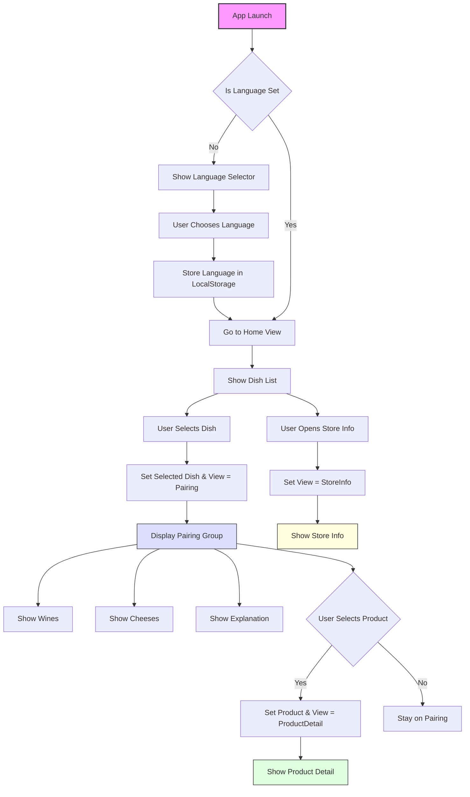

</br>

> **Diagram Legend**
> - 🟣 Purple node = App entry point  
> - 🔵 Blue node = Pairing engine logic  
> - 🟢 Green node = Product detail logic  
> - 🟡 Yellow node = Store information  
> - Diamonds = Conditional user choices
> - Arrows = Bubble[¹](#glossary-bubble) state or group transitions

--- 

## III. Database Model

This section outlines the structure and logic of the underlying data model used within the application. The database is designed according to normalized principles, leveraging Bubble[¹](#glossary-bubble)’s object-based system to represent entities and their relationships in a clean, reusable, and scalable manner.

All data is managed manually in the Bubble[¹](#glossary-bubble) Editor and exposed to the client in read-only mode. There are no user-generated records, no authentication, and no API-based writes in version 1.

---

### 3.1 Overview of Data Entities

The application operates on six custom data types, each serving a distinct function in the user experience and business logic:

| Data Type     | Role                                                                 |
|---------------|----------------------------------------------------------------------|
| `Dish`        | Represents a culinary dish chosen by the user                        |
| `PairingRule[¹⁰](#glossary-pairingrule)` | Defines the recommended wines and cheeses for a specific dish        |
| `Wine`        | Encapsulates a wine product, including tasting notes and legal info  |
| `Cheese`      | Encapsulates a cheese product, including origin and allergen details |
| `StoreInfo`   | Stores static information about the Intermarché store                |
| `Translation` | Stores multilingual key-value pairs for interface localization       |

All entities are independent objects in Bubble[¹](#glossary-bubble)’s database and referenced relationally where needed.

---

### 3.2 Entity Relationships

Relationships between data types are implemented using direct object references within Bubble[¹](#glossary-bubble). Although Bubble[¹](#glossary-bubble) does not support SQL joins, the structure adheres to traditional relational logic.

| Source Entity  | Related Entity | Relationship Type | Description                                                  |
|----------------|----------------|-------------------|--------------------------------------------------------------|
| `Dish`         | `PairingRule[¹⁰](#glossary-pairingrule)`  | 1:1               | Each dish is associated with one unique pairing rule         |
| `PairingRule[¹⁰](#glossary-pairingrule)`  | `Wine`         | 1:N               | A rule includes one or more wine recommendations             |
| `PairingRule[¹⁰](#glossary-pairingrule)`  | `Cheese`       | 1:N               | A rule includes one or more cheese recommendations           |
| `Translation`  | -              | Key-value         | Used to retrieve multilingual UI strings based on a key      |

> All `PairingRule[¹⁰](#glossary-pairingrule)` entries are considered exclusive to a single `Dish`. Wines and cheeses are reusable and may appear in multiple pairings.

---

### 3.3 Entity Relationship Diagram (ERD[¹⁵](#glossary-erd))

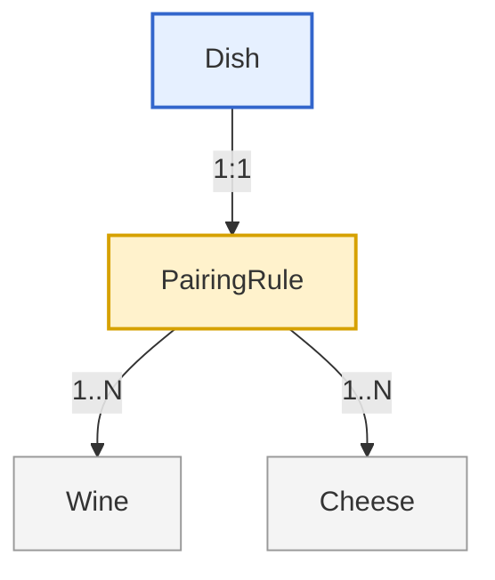

---

### 3.4 Sample Dataset

The table below illustrates how entities interact using a real-world example:

#### Dish: Cassoulet

| Field       | Value         |
|-------------|---------------|
| name        | Cassoulet     |
| category    | Main Dish     |
| slug[¹⁶](#glossary-slug)        | cassoulet     |
| image       | cassoulet.jpg |

#### PairingRule[¹⁰](#glossary-pairingrule) (linked to Cassoulet)

| Field       | Value                                                                       |
|-------------|-----------------------------------------------------------------------------|
| dish        | Reference to “Cassoulet”                                                    |
| wines       | [Cahors Rouge, Madiran]                                                     |
| cheeses     | [Tomme de Savoie, Laguiole]                                                 |
| explanation | "Robust dishes call for full-bodied reds and aged mountain cheeses."       |

#### Wine: Cahors Rouge

| Field         | Value         |
|---------------|---------------|
| name          | Cahors Rouge  |
| region        | Sud-Ouest     |
| taste_profile | Tannic, earthy|
| price         | 6.50€         |
| legal_notice  | true          |
| image         | cahors.jpg    |

#### Cheese: Tomme de Savoie

| Field     | Value           |
|-----------|-----------------|
| name      | Tomme de Savoie |
| region    | Rhône-Alpes     |
| texture   | Semi-firm       |
| allergens | [Milk]          |
| image     | tomme.jpg       |

---

### 3.5 Design Principles

The model adheres to the following architectural and data design principles:

- **Normalization**: Products (wines and cheeses) are stored independently and linked via reference lists to avoid data duplication.
- **Scalability**: Additional dishes and pairing rules can be added without restructuring the schema.
- **Localization-friendly**: All translatable strings are stored in the `Translation` table, decoupling UI content from logic.
- **Legal compliance**: Fields related to allergens and alcohol warnings are mandatory in the schema.

---

### 3.6 Future Extensions

This structure supports the following extensions without requiring changes to the existing schema:

- Multi-store support via a `Store` data type with linked `Product` entities
- User accounts with favorite pairings or saved preferences
- Admin interface for real-time content management
- Integration with APIs for pricing or availability updates

---

### 3.7 Optional Data Type: `Translation`

Used only if not relying on the Bubble[¹](#glossary-bubble) Multilingual Plugin.

| Field Name | Type | Required | Searchable | Description                            |
|------------|------|----------|------------|----------------------------------------|
| `key`      | Text | ✅       | ✅         | Identifier for UI text (e.g., `btn_home`) |
| `french`   | Text | ✅       | ❌         | Translation in French                   |
| `english`  | Text | ✅       | ❌         | Translation in English                  |

- 🧠 Use in dynamic text logic: e.g., `Do a search for Translation where key = "page_title"` and `Current language = French`
- ⚠️ Keys must be unique (enforced manually)

---

### 3.8 General Bubble Settings (Data Layer)

- **Database privacy rules[¹³](#glossary-privacy-rules)**:
  - All types are public read-only
  - No write operations exist via front-end workflows[⁵](#glossary-workflow)
- **Field validations** (to implement via UI logic):
  - Required fields must not be empty before saving new records
  - Images must be uploaded before record is used in production
- **Slug[¹⁶](#glossary-slug) generation**:
  - Used to build clean URLs (`/dish/cassoulet`) via dynamic page routing

---

## IV. User Workflows

This section describes the core user journeys within the app and how they are implemented in Bubble[¹](#glossary-bubble). Each workflow[⁵](#glossary-workflow) includes the triggering events, state changes, conditional logic, and relevant error handling.

All workflows[⁵](#glossary-workflow) rely on Bubble[¹](#glossary-bubble)'s **visual logic editor**, using:
- Custom states[⁴](#glossary-custom-state) to track navigation and selected content
- Event triggers (`Element is clicked`, `Input value changed`, `Page is loaded`)
- Conditional visibility of groups

---

### 4.1 Language Selection Workflow

**Trigger:** App is opened for the first time or `selected_language` is unset\

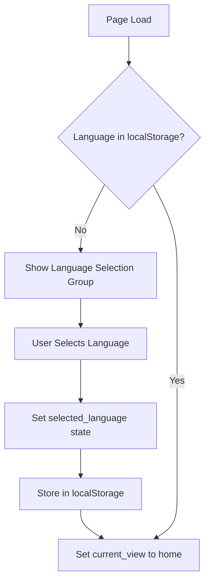

**Workflow[⁵](#glossary-workflow) Steps:**
1. **On page load:**
   - Check if `selected_language` is stored in local storage.
   - If not found, show the `group_language_select` group.

2. **On button click (language choice):**
   - `Set custom state[⁴](#glossary-custom-state)`: `selected_language = "fr"` or `"en"`
   - `Run JavaScript` (optional): Save language in `localStorage[⁷](#glossary-localstorage)`
   - Hide the language group and set `current_view[¹¹](#glossary-current-view) = "home"`

**Notes:**
- All dynamic texts in the UI refer to `selected_language` to load the appropriate version.

---

### 4.2 Dish Search Workflow

**Trigger:** User types in the search input or selects a category filter

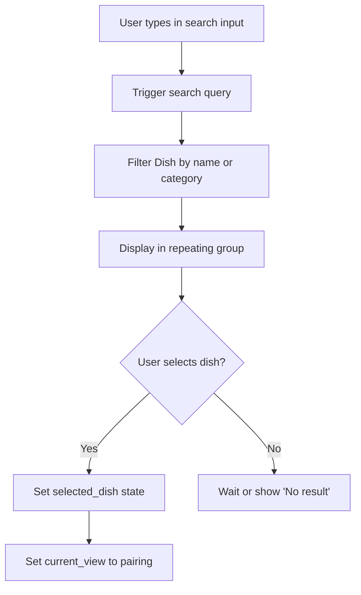

**Workflow[⁵](#glossary-workflow) Steps:**
1. **When input value is changed:**
   - Use "Do a search for Dish" with `name contains input_value`
   - Filter optionally by `category`

2. **Display results in repeating group[⁶](#glossary-repeating-group):**
   - Data source = filtered list of Dish
   - Each row has a clickable group or button

3. **When user selects a dish:**
   - Set `selected_dish` (custom state[⁴](#glossary-custom-state) on page)
   - Set `current_view[¹¹](#glossary-current-view) = "pairing"`

**Edge Handling:**
- If no dishes match, show a text warning: "No matching dish found."

---

### 4.3 Pairing Recommendations Workflow

**Trigger:** `current_view[¹¹](#glossary-current-view)` is set to `"pairing"` and `selected_dish` is not empty

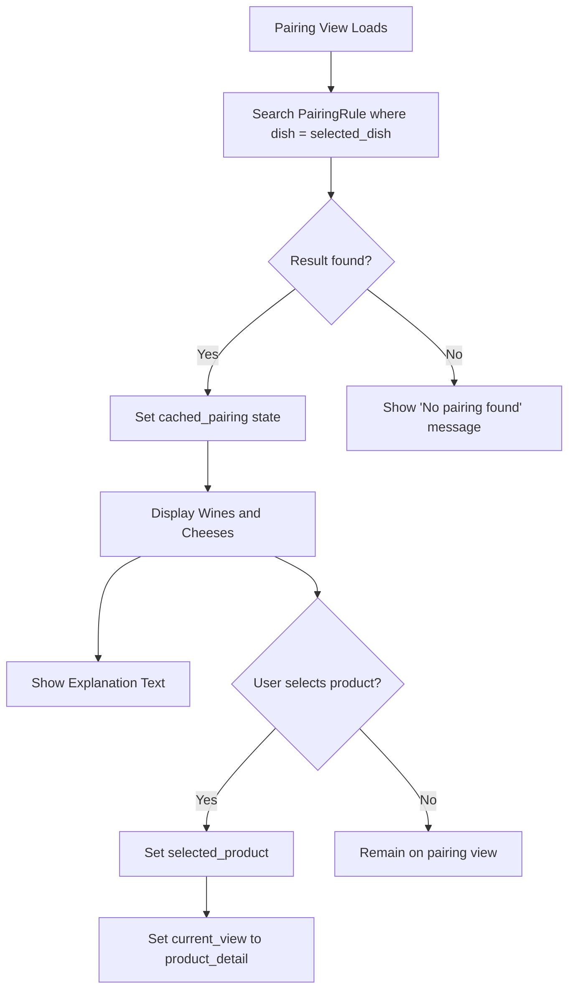

**Workflow[⁵](#glossary-workflow) Steps:**
1. **On group display condition (pairing view):**
   - Run a search: `PairingRule[¹⁰](#glossary-pairingrule) where Dish = selected_dish`
   - Set `cached_pairing` (custom state[⁴](#glossary-custom-state))

2. **Bind data to elements:**
   - `cached_pairing.wines` → horizontal repeating group[⁶](#glossary-repeating-group) (wine cards)
   - `cached_pairing.cheeses` → repeating group[⁶](#glossary-repeating-group) (cheese cards)
   - `cached_pairing.explanation` → text box

3. **On wine/cheese click:**
   - Set `selected_product` (custom state[⁴](#glossary-custom-state))
   - Set `current_view[¹¹](#glossary-current-view) = "product_detail"`

**Error Handling:**
- If `PairingRule[¹⁰](#glossary-pairingrule)` is empty → Show fallback: "No pairing available for this dish."

---

### 4.4 Product Detail View Workflow

**Trigger:** `current_view[¹¹](#glossary-current-view) = "product_detail"` and `selected_product` is set

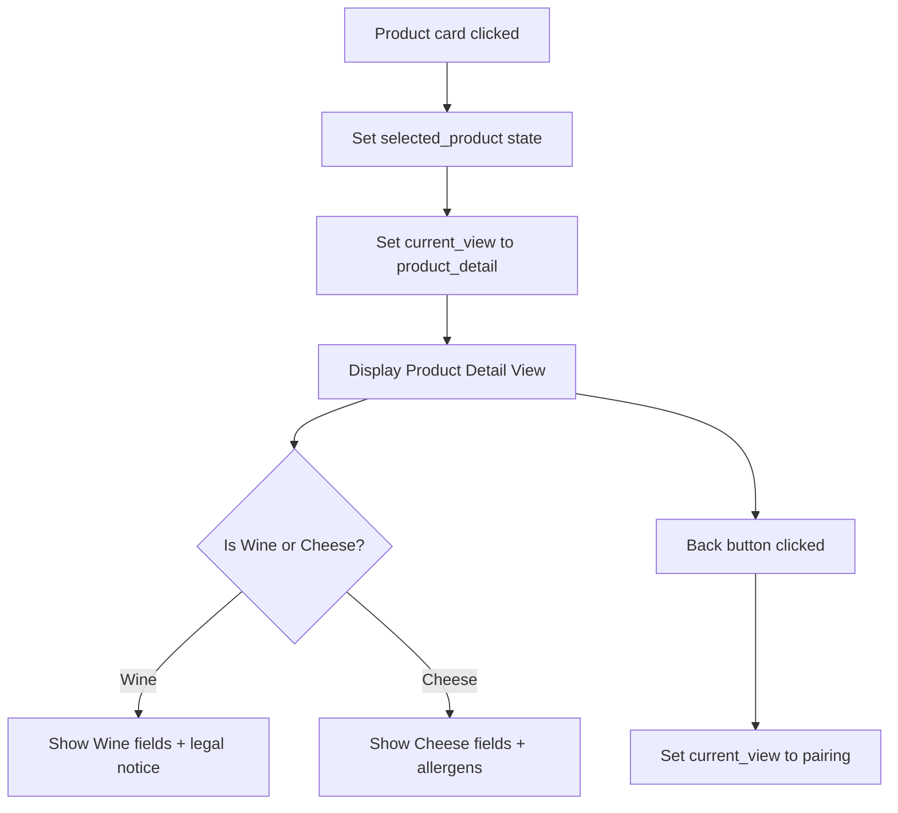

**Workflow[⁵](#glossary-workflow) Steps:**
1. **When product is clicked from pairing list:**
   - `Set state`: `selected_product = current cell’s Wine or Cheese`
   - `Set state`: `current_view[¹¹](#glossary-current-view) = "product_detail"`

2. **On product detail group visibility:**
   - Use `Only when selected_product is not empty`
   - Use `Type of content` = Wine or Cheese (based on state or page parameter)
   - Dynamically show:
     - `name`, `image`, `region`, `taste_profile`
     - For wine: show `legal_notice`
     - For cheese: show `allergens` as pill tags or bulleted list

3. **Back button:**
   - `Set state`: `current_view[¹¹](#glossary-current-view) = "pairing"`

---

### 4.5 Store Information View Workflow

**Trigger:** User taps “Store Info” from menu/footer

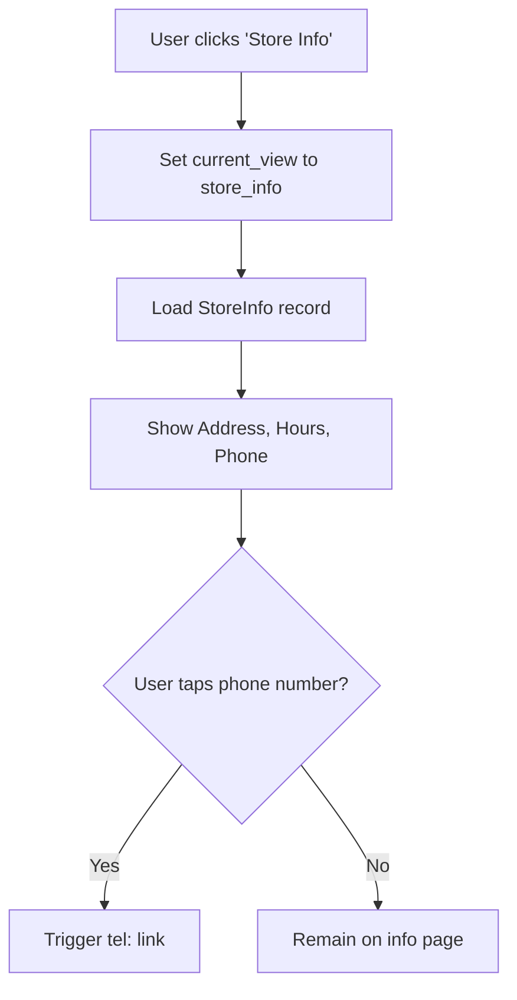

**Workflow[⁵](#glossary-workflow) Steps:**
1. **Button click:**
   - `Set state`: `current_view[¹¹](#glossary-current-view) = "store_info"`

2. **When store info group is visible:**
   - Fetch data from static `StoreInfo` entry
   - Show:
     - Address
     - Opening hours
     - Holiday exceptions
     - Click-to-call phone number (`tel:` link)

---

### 4.6 Accessibility Options (Optional Future Feature)

**Trigger:** User opens accessibility settings (from menu)

```mermaid
flowchart TD
    A[User opens Accessibility Settings] --> B[Select Text Size or Contrast]
    B --> C[Update custom state[⁴](#glossary-custom-state) or localStorage]
    C --> D[Apply conditional styles to groups]
    D --> E[Changes reflected in real time]
```

**Workflow[⁵](#glossary-workflow) Steps (if implemented):**
1. User selects:
   - “Large Text” → Apply conditional styles (e.g., dynamic font size)
   - “High Contrast” → Show high-contrast version of text/buttons

2. Store choice in `localStorage[⁷](#glossary-localstorage)` or custom state[⁴](#glossary-custom-state) (`accessibility_mode`)
3. Apply changes dynamically to all pages via conditionals on group styles

---

### 4.7 Offline Fallback Workflow

**Trigger:** App opens with no internet connection

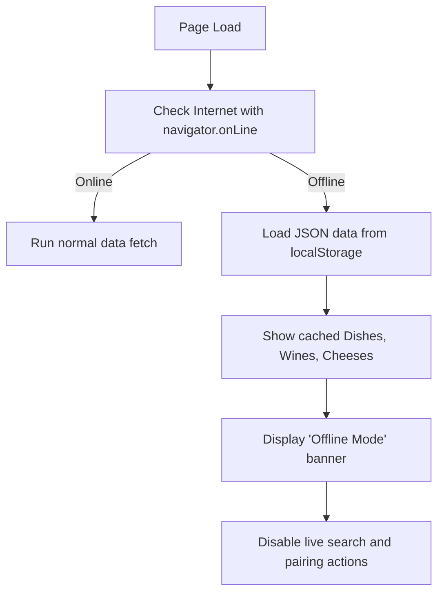

**Workflow[⁵](#glossary-workflow) Steps:**
1. On page load:
   - Use a plugin or custom JS to check network status (`navigator.onLine[⁹](#glossary-navigator-online)`)
   - If offline:
     - Try to load cached JSON data from `localStorage[⁷](#glossary-localstorage)`
     - Populate repeating groups[⁶](#glossary-repeating-group) with fallback dish/wine/cheese data
     - Show alert: “You’re offline. Showing saved results only.”

2. Disable actions that require fresh DB queries or navigation

---

## 4.8 Workflow Summary Table

The following table summarizes the primary user workflows[⁵](#glossary-workflow) implemented in the application. Each entry identifies the trigger event, the key custom states[⁴](#glossary-custom-state) affected, and the visual components involved in the process.

| Workflow[⁵](#glossary-workflow)                | Trigger                         | Main States Affected         | UI Components / Groups Involved              |
|-------------------------|----------------------------------|-------------------------------|-----------------------------------------------|
| Language Selection      | Page load or first-time visit    | `selected_language`, `current_view[¹¹](#glossary-current-view)` | `group_language_select`, `group_home`         |
| Dish Search             | Input value changed              | `selected_dish`, `current_view[¹¹](#glossary-current-view)`     | `search_input`, `group_dish_list`             |
| Dish Selection          | Dish card click                  | `selected_dish`, `current_view[¹¹](#glossary-current-view)`     | `repeating_group_dishes`, `group_pairing`     |
| Load Pairing Rule       | View = "pairing"                 | `cached_pairing`                   | `group_pairing`, `group_pairing_details`      |
| Select Wine or Cheese   | Product card click               | `selected_product`, `current_view[¹¹](#glossary-current-view)` | `group_pairing`, `group_product_detail`       |
| Return to Pairing View  | Back button from product view    | `current_view[¹¹](#glossary-current-view)`                     | `group_product_detail`, `group_pairing`       |
| View Store Info         | Menu or footer button click      | `current_view[¹¹](#glossary-current-view)`                     | `group_store_info`                            |
| Offline Mode[¹⁴](#glossary-offline-mode) Detection  | Page load (with `navigator.onLine[⁹](#glossary-navigator-online)`) | (None directly)              | `group_offline_alert`, cached data (optional) |
| Translation Loading     | Page load or state change        | `selected_language`               | All dynamic text elements via `Translation`   |

---

Each workflow[⁵](#glossary-workflow) is implemented using Bubble[¹](#glossary-bubble)'s **visual workflow[⁵](#glossary-workflow) editor**, and conditional rendering is managed via **custom states[⁴](#glossary-custom-state)** and group visibility logic. Some flows also rely on JavaScript via the **Toolbox Plugin[⁸](#glossary-toolbox)**, particularly for localStorage[⁷](#glossary-localstorage) handling and offline detection.

### 4.8 Custom State Lifecycle Summary

| State Name         | When Set                             | Reset/Cleared When                           |
|--------------------|--------------------------------------|----------------------------------------------|
| `selected_language`| On language selection or page load   | Never (persisted via `localStorage[⁷](#glossary-localstorage)`)         |
| `current_view[¹¹](#glossary-current-view)`     | On any navigation click              | Updated continuously on view change          |
| `selected_dish`    | On dish selection                    | Cleared when returning to dish list view     |
| `cached_pairing`   | After pairing rule is retrieved      | Cleared on new dish selection                |
| `selected_product` | On wine/cheese click                 | Cleared when returning to pairing view       |

---

## V. Multilingual Support

This section details how the application supports multilingual content (French and English) using Bubble[¹](#glossary-bubble)’s dynamic text system. It explains both approaches — plugin-based and database-based — and provides recommendations, structure, and technical implementation steps.

---

### 5.1 Supported Languages

- **French** (default)
- **English**

Additional languages (e.g. SPA[³](#glossary-spa)nish, German) can be added in v2 using the same architecture.

---

### 5.2 Implementation Options

#### Option 1: Bubble[¹](#glossary-bubble)'s Built-In Multilingual Plugin

- Add the **"Multilingual" plugin** from the Bubble[¹](#glossary-bubble) Plugin Library.
- Translate static UI text (e.g., button labels, page titles) directly in the Bubble[¹](#glossary-bubble) editor.
- Uses `App Texts` and language selectors natively integrated in Bubble[¹](#glossary-bubble).

**Pros:**
- Fastest to implement
- Built-in performance optimization

**Cons:**
- Only handles static text (not dish names, descriptions, or pairing explanations)
- No dynamic data translation support

#### Option 2: Custom `Translation` Data Type

- Create a new data type called `Translation` with the following fields:

| Field     | Type | Description                        |
|-----------|------|------------------------------------|
| `key`     | Text | Unique identifier (`btn_submit`)   |
| `french`  | Text | French version                     |
| `english` | Text | English version                    |

- Reference translation keys dynamically using expressions like:
  - `"Do a search for Translation where key = 'btn_submit'" → `Current selected_language` field`

**Pros:**
- Centralized control of all translatable content
- Works with dynamic or rich text

**Cons:**
- Slight performance overhead
- Requires more careful structuring

> ✅ **Recommended Hybrid Strategy:**  
> Use the **Bubble[¹](#glossary-bubble) multilingual plugin** for static interface labels, and the **`Translation` data type** for any dynamic or structured content (e.g., dish categories, explanations).

---

### 5.3 Language Selection & Persistence

#### First Visit (No language stored)

1. Show `group_language_select`  
2. On user click:  
   - Set custom state[⁴](#glossary-custom-state): `selected_language = "fr"` or `"en"`  
   - Use **Toolbox Plugin[⁸](#glossary-toolbox)’s "Run JavaScript"** action to store the language in `localStorage[⁷](#glossary-localstorage)`:  
     Example: `localStorage[⁷](#glossary-localstorage).setItem("language", "fr");`

---

#### On Subsequent Visits

- On page load:  
  - Use **Toolbox[⁸](#glossary-toolbox)'s JavaScript action** to retrieve the language from `localStorage[⁷](#glossary-localstorage)`:  
    Example: `localStorage[⁷](#glossary-localstorage).getItem("language")`  
  - Store the retrieved value in the `selected_language` custom state[⁴](#glossary-custom-state)  
  - Skip the language selection group if a valid language is found  

---

This allows consistent language persistence across sessions and ensures that every dynamic text element displays in the appropriate language context.

### 5.4 Usage in Dynamic Text

To display the correct translation:

```text
Do a search for Translation:first item
Where key = "title_home"
Display: current language's field (french or english)
```

Example:

```text
Search: Translation:key = "title_home" → 
selected_language is "fr" → show French
selected_language is "en" → show English
```

Use conditional expressions for this if not using advanced plugins.

### 5.5 Optimizations for Repeated Translations

To avoid repeated searches:  
- On page load, preload translations into a custom state[⁴](#glossary-custom-state) (list of `Translation`)  
- Use `:filtered` in expressions instead of repeated database searches  

Example:  

```text
Page's translations:filtered  
Where key = "section_title"  
```

Or pre-map to a JSON object stored in localStorage[⁷](#glossary-localstorage) (advanced).

---

### 5.6 Error Handling & Fallback

If a translation key is missing or fails:  
- Fallback to `french`  
- Optionally, show placeholder `[missing:key_name]` in dev mode  

This ensures the UI remains functional and debug-friendly.

---

### 5.7 UI and Design Considerations

- All text containers must allow wrapping  
- Avoid fixed widths on buttons — text length differs across languages  
- Font sizes may need to adjust dynamically (via styles or conditions)  

Examples of longer strings in French must be tested on mobile layout.

---

### 5.8 Mermaid Diagram[¹⁵](#glossary-mermaid) – Custom Language Load Logic

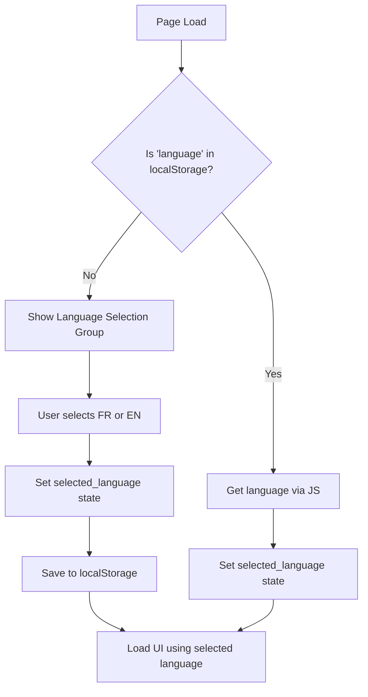

---

### 5.9 Maintenance & Scaling

- Keep a spreadsheet of all translation keys and values  
- On update:  
  - Add new keys to the database  
  - Ensure both languages are filled before publishing  

For future scalability, consider:  
- Language grouping (e.g., `scope = pairing`, `scope = ui`)  
- External JSON sync for non-technical updates  

---

## VI. Design & Responsiveness

This section details how the app is visually structured and optimized for mobile-first use on the Bubble[¹](#glossary-bubble) platform. It covers responsive layout setup, accessibility, image behavior, and dynamic scaling across screen sizes.

---

### 6.1 Design Principles

The UI follows these principles:

- **Mobile-first**: All pages are designed primarily for screens 320–480px wide  
- **Clarity and hierarchy**: Emphasis on large images and readable typography  
- **Consistency**: Reusable elements and layout grids ensure unified structure  
- **Accessibility**: Designed for large tap targets and readable contrast  

---

### 6.2 Page Structure and Layouts

All views are built as **groups within a single index page**, controlled by the `current_view[¹¹](#glossary-current-view)` custom state[⁴](#glossary-custom-state). Each major view is responsive and includes:

View Name         | Type       | Contains  
------------------|------------|----------------------------------------------------  
Home View         | Group      | Search input, dish repeating group[⁶](#glossary-repeating-group)  
Pairing View      | Group      | Wines, cheeses, explanation area  
Product Detail    | Group/Popup| Product image, fields, legal/allergen notice  
Store Info        | Group      | Static contact details  
Language Select   | Group      | First-launch language options  

Reusable elements (e.g., footer, header) are inserted across views where needed.

---

### 6.3 Bubble[¹](#glossary-bubble) Responsive Engine Setup

- **Layout mode**: All groups use the new Bubble[¹](#glossary-bubble) responsive engine[¹²](#glossary-responsive-engine)  
- **Container layout**:  
  - Top-level = Column (for vertical stacking)  
  - Inner content = Row or Align to Parent where needed  
- **SPA[³](#glossary-spa)cing strategy**:  
  - Use `gap` instead of margin where possible  
  - Minimum margin = 16px for mobile padding  
- **Max width**: Page is capped at 420px for centered experience on larger devices  

---

### 6.4 Font and Typography

- **Font family**: Clean, web-safe sans-serif (e.g., Inter, Open Sans)  
- **Font sizes**:  
  - Headings: 20–24px  
  - Body text: 16–18px  
  - Small labels: Minimum 14px  
- **Line height**: 1.4–1.6 for all text blocks  
- **Font scaling**: Use conditional styles if text is too large on small devices  

---

### 6.5 Images and Visual Assets

- **Aspect ratio**: 1:1 (square) or 3:2 for most product images  
- **Compression**: All images must be optimized before upload (e.g., TinyPNG)  
- **Delivery**: Enable “processed with Imgix” in Bubble[¹](#glossary-bubble) to auto-scale images  
- **Lazy loading**: Use Bubble[¹](#glossary-bubble)’s native image loading (avoid loading hidden images)  

---

### 6.6 Responsiveness Across Devices

Screen Size        | Status  
-------------------|--------  
320–480px (phones) | Fully optimized  
768px (tablets)    | Layout degrades gracefully  
>1024px (desktop)  | Centered layout, no expanded UI  

Responsive behavior is validated in Bubble[¹](#glossary-bubble)’s **Responsive tab** and via Chrome DevTools (mobile emulation).

---

### 6.7 Accessibility Features

- **Tap targets**: All buttons and icons have a minimum of 44x44px  
- **Color contrast**: All text meets WCAG AA standards (4.5:1 or higher)  
- **Language toggles**: Clearly labeled buttons with ARIA descriptions (optional)  
- **Alt text**: All product images include alt text dynamically set from the name field  
- **Optional**: Add `accessibility_mode` state for larger font toggle (future feature)  

---

### 6.8 Layout Fallback Logic

- If text overflows due to long translations:  
  - Text wraps in containers  
  - Font size auto-reduces for titles (optional condition)  
- Use conditional groups to manage layout overrides for extremely small (<320px) screens  

---

### 6.9 Mermaid Diagram[¹⁵](#glossary-mermaid) – Responsive Behavior Strategy

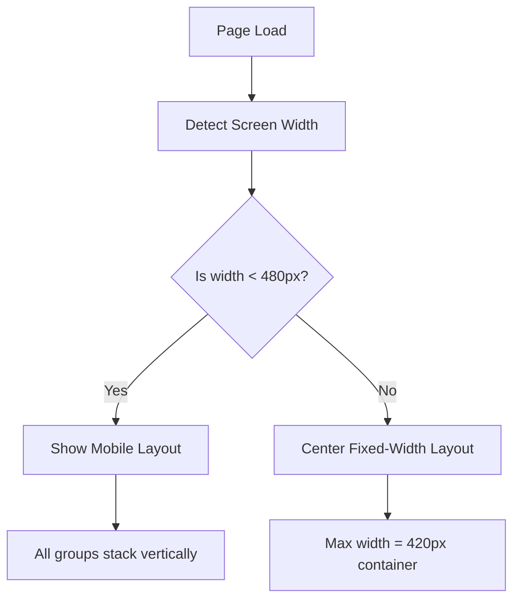

---

Let me know if you’d like to continue with Section 7: Performance Considerations.

## VII. Performance Considerations

This section details how the app is optimized to load quickly, execute workflows[⁵](#glossary-workflow) efficiently, and minimize bottlenecks using Bubble[¹](#glossary-bubble)'s performance tools and design best practices.

---

### 7.1 Performance Targets

| Operation                     | Target Time       |
|------------------------------|-------------------|
| App launch (cold start)      | < 2 seconds       |
| Page view switch (SPA[³](#glossary-spa) logic) | < 500 ms          |
| Search query results         | < 1 second        |
| Product detail load          | < 800 ms          |
| Pairing display              | < 1 second        |

> Tested on 4G connection and mid-range mobile devices

---

### 7.2 Bubble[¹](#glossary-bubble) Optimization Strategies

#### 7.2.1 Minimize Real-Time Queries

- Avoid "Do a search for..." on visible elements unless necessary  
- Preload data in hidden workflows[⁵](#glossary-workflow) or use `:filtered` on loaded lists  

#### 7.2.2 Use Custom states for Caching

- Store results (like selected dish, pairing, translations) in page-level custom states[⁴](#glossary-custom-state)  
- Prevent repeated calls by reusing states across views  

#### 7.2.3 Repeating Group Best Practices

- Use constraints to reduce result volume  
- Limit cells per page (e.g., 4–8 items for mobile)  
- Avoid nested repeating groups[⁶](#glossary-repeating-group) entirely  

#### 7.2.4 Group Visibility Strategy

- Set non-active groups to "This element is not visible on page load"  
- Use conditionals tied to `current_view[¹¹](#glossary-current-view)` to prevent rendering inactive views  
- Avoid complex visibility conditions with multiple AND/OR checks  

---

### 7.3 Image Optimization

- All product images must be compressed before upload  
- Bubble[¹](#glossary-bubble) setting "Processed with Imgix" must be enabled  
- Use fixed image dimensions for display (e.g., 300x200px)  
- Avoid loading full-size images in thumbnails or repeating groups[⁶](#glossary-repeating-group)  

---

### 7.4 Offline Behavior Handling

- Dish, wine, and cheese lists can be cached in `localStorage[⁷](#glossary-localstorage)` as JSON  
- If `navigator.onLine[⁹](#glossary-navigator-online)` is false:
  - Load content from storage if available  
  - Show "Offline Mode[¹⁴](#glossary-offline-mode)" warning  
  - Disable new searches and view switching that require fresh data  

---

### 7.5 Device & Network Testing

Tested on:

- iPhone SE, 11, 14 (Safari and Chrome)  
- Android (Pixel, Samsung, Chrome)  
- Desktop fallback (Chrome, Safari)  

Simulated slow 3G using Chrome DevTools for cold start scenarios.

---

### 7.6 Debugging & Profiling

#### Bubble[¹](#glossary-bubble) Debug Mode

- Append `?debug_mode=true` to the app URL to trace workflow[⁵](#glossary-workflow) steps live  
- Use step-by-step mode to verify conditional logic and state changes  
- Especially useful for testing custom event triggers and group visibility flows

---

#### Bubble[¹](#glossary-bubble) Logs & Performance Panel

- Inspect errors and workflow[⁵](#glossary-workflow) durations in **Logs → Server logs**  
- Use the **Performance tab** to identify:
  - Slow or resource-heavy workflows[⁵](#glossary-workflow)  
  - Inefficient searches or recursive events  
  - Excessive CPU capacity usage

---

#### Console-Based JavaScript Debugging (via Toolbox[⁸](#glossary-toolbox))

The **Toolbox Plugin[⁸](#glossary-toolbox)** is used to run JavaScript directly within workflows[⁵](#glossary-workflow), allowing deeper visibility into the app’s state and logic.

Use cases include:

- Logging values to the browser console:
  - `console.log(selected_language)`
  - `console.log(localStorage[⁷](#glossary-localstorage).getItem("language"))`
- Verifying condition results, query outputs, or responsive breakpoints
- Debugging offline mode[¹⁴](#glossary-offline-mode) by checking `navigator.onLine[⁹](#glossary-navigator-online)` in real time

> These diagnostics are visible in the browser’s Developer Tools console and do not interfere with Bubble[¹](#glossary-bubble)’s visual debugger.

---

This hybrid approach (Bubble[¹](#glossary-bubble) native tools + Toolbox[⁸](#glossary-toolbox)-enhanced JS logging) allows full control over both low-code and raw execution paths during testing.

### 7.7 Mermaid Diagram[¹⁵](#glossary-mermaid) – Workflow vs Query Optimization

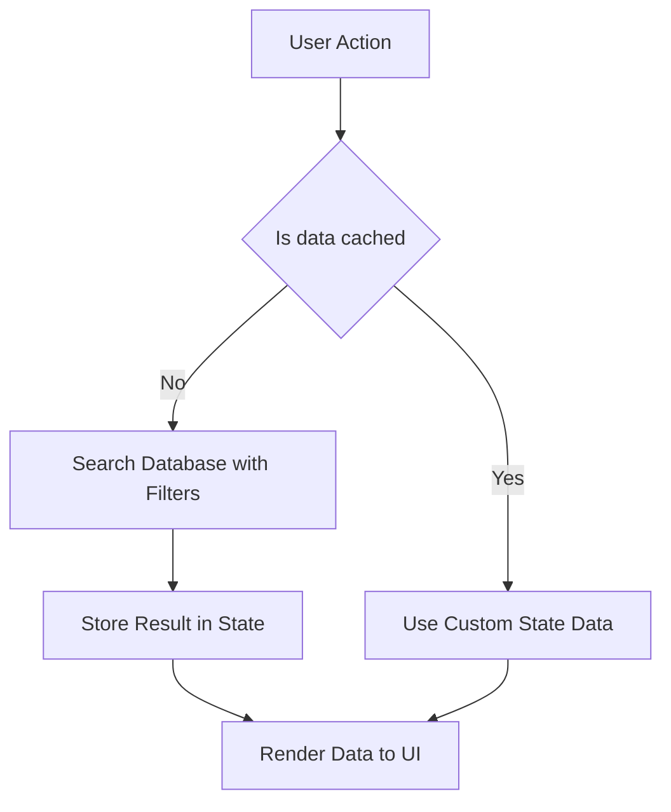

---


## VIII. Security & Compliance

This section outlines the app's security posture and legal compliance strategy. Since the app is Bubble[¹](#glossary-bubble)-based and does not use authentication or sensitive user data, the focus is on ensuring responsible content delivery, data visibility control, and legal obligations related to alcohol and allergens.

---

### 8.1 Personal Data Handling

- The app does **not use accounts or authentication**
- No personal user data is collected, stored, or tracked
- There is **no user session history**, analytics, or personalized behavior logging

---

### 8.2 Local Storage Use

- `selected_language` is stored via `localStorage[⁷](#glossary-localstorage)` using JavaScript  
- Optional: cached dish/wine/cheese lists in JSON for offline mode[¹⁴](#glossary-offline-mode)  
- No sensitive or identifiable information is stored in the browser

---

### 8.3 GDPR and Privacy Compliance

- App is **GDPR compliant by design**:  
  - No cookies, tracking, or account creation  
  - No consent banner required  
  - Optional privacy policy page can be added for tranSPA[³](#glossary-spa)rency  

---

### 8.4 Alcohol-Related Legal Requirements

#### Legal Disclaimer

- Every **Wine detail view** must include the following disclaimer, visible at all times:  
  _“Alcohol consumption is prohibited for minors under 18 years. Drink responsibly.”_

- Display is enforced by:
  - Conditional group inside the wine detail view
  - Cannot be hidden or collapsed by the user

#### Promotion Restrictions

- No "Buy now", pricing emphasis, or discount language allowed
- Descriptions must be factual (e.g., taste profile, origin), not persuasive

---

### 8.5 Allergen Labeling (Cheese)

#### Mandatory Disclosure

- All `Cheese` records must include at least one allergen (e.g., Milk, Egg)
- Displayed as pill tags or bulleted text block in the Product Detail view

#### Integrity Enforcement

- Allergen field is required in the Bubble[¹](#glossary-bubble) database  
- Product uploads are manually reviewed before publication

---

### 8.6 Access Control in Bubble

| Feature             | Status         |
|---------------------|----------------|
| Bubble[¹](#glossary-bubble) privacy rules[¹³](#glossary-privacy-rules)| Optional       |
| Admin Backend       | Not implemented in v1 |
| API Workflow[⁵](#glossary-workflow) Access | Disabled       |
| Page protection     | Not required   |

- Database fields are public read-only  
- No "admin-only" content is exposed on the front-end  
- All Bubble[¹](#glossary-bubble) backend workflows[⁵](#glossary-workflow) are disabled or unused  

---

### 8.7 Content Governance

- All app content is managed manually through the Bubble[¹](#glossary-bubble) editor  
- Only trusted team members (e.g., developer, store manager) should have editor access  
- Recommend Bubble[¹](#glossary-bubble)'s **Team Plan** or higher for version control and editor permissions

---

### 8.8 Mermaid Diagram[¹⁵](#glossary-mermaid) – Legal Enforcement Flow (Wine View)

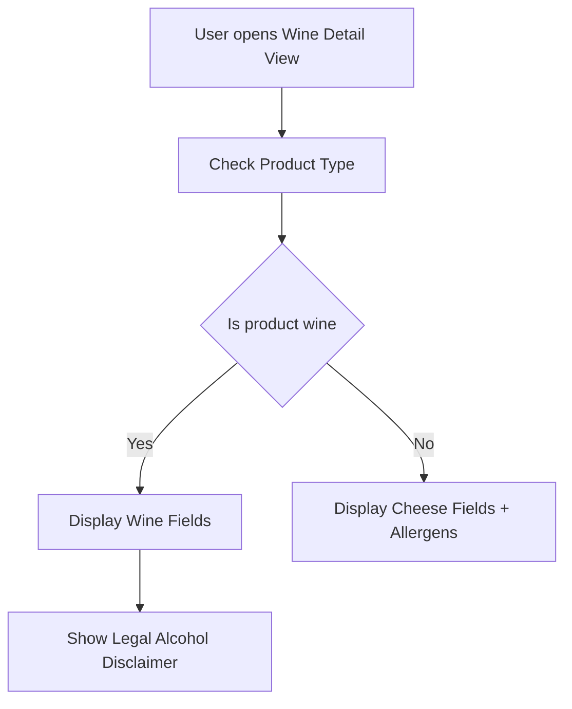

---

## IX. Limitations

This section identifies the current limitations of the application due to platform constraints, intentional feature exclusions in version 1, and trade-offs related to performance, security, and design scope. These limitations must be acknowledged during development and communicated to stakeholders.

---

### 9.1 Technical Platform Limitations (Bubble)

While Bubble[¹](#glossary-bubble) enables fast prototyping and visual development, it imposes several limitations in version 1 of this application:

| Limitation                           | Description                                                 |
|-------------------------------------|-------------------------------------------------------------|
| No server-side logic                | All processing happens in the client browser                |
| No background jobs                  | Cannot run scheduled tasks or batch updates                 |
| No native device access             | Cannot use camera, GPS, or notifications natively           |
| No secure file storage              | Images are public and not suitable for private data         |
| Limited query complexity            | No joins or relational filters across types in a single query |
| Limited browser storage             | Only `localStorage[⁷](#glossary-localstorage)` and `sessionStorage` via custom JS      |

> ✅ Some limitations (e.g., storage access and browser API usage) are partially mitigated using the **Toolbox Plugin[⁸](#glossary-toolbox)**, which enables direct JavaScript execution inside Bubble[¹](#glossary-bubble) workflows[⁵](#glossary-workflow).

---

### 9.2 Offline Behavior Constraints

- No true "offline-first" functionality  
- Only cached read-only content can be displayed (preloaded JSON)  
- No updates, search, or state changes possible while offline  
- Browser refresh clears session-based custom states[⁴](#glossary-custom-state)

---

### 9.3 Functional Limitations in Version 1

| Feature                          | Status          |
|----------------------------------|-----------------|
| User login / accounts            | Not implemented |
| Shopping cart / saved items      | Not included    |
| Admin CMS                        | Not available   |
| Multi-store support              | Not planned in v1 |
| Live pricing or stock updates    | Not integrated  |
| User-generated content (reviews) | Excluded        |

All data updates (products, pairings, translations) must be performed manually in the Bubble[¹](#glossary-bubble) editor.

---

### 9.4 Design Constraints

- UI is optimized for **mobile portrait mode only**  
- Tablet and desktop layouts are supported as fallback only  
- Translations are limited to **French and English** in v1  
- Text expansion in some languages (e.g., German) may break layout if added later

---

### 9.5 Security Boundaries

- No account system = no session security or access control  
- Public app = no page protection or user roles  
- Only basic client-side protection in place (e.g., hidden groups)

---

### 9.6 Architectural Trade-offs

The application design involves deliberate architectural decisions optimized for simplicity, performance, and rapid deployment within the Bubble[¹](#glossary-bubble) ecosystem.

| Decision                                | Benefit                             | Limitation                             |
|-----------------------------------------|-------------------------------------|----------------------------------------|
| Single-page app using `current_view[¹¹](#glossary-current-view)`    | Fast, fluid navigation              | Requires careful state management      |
| No authentication system                | Simplifies privacy and security     | No personalization or saved history    |
| Static Bubble[¹](#glossary-bubble) database (no API)         | Easy to manage and test             | No external integrations or automation |
| Manual translations via DB              | Fully customizable                  | Requires maintenance of translation keys |
| No plugins for UI or design             | Fewer dependencies                  | More manual work (e.g., no auto-layout) |
| Use of Toolbox[⁸](#glossary-toolbox) for logic                | Enables access to native JS features | Introduces reliance on plugin updates  |

> The use of the **Toolbox Plugin[⁸](#glossary-toolbox)** offers significant flexibility (e.g., `localStorage[⁷](#glossary-localstorage)`, `console.log`, offline detection), but must be maintained over time to ensure compatibility with Bubble[¹](#glossary-bubble) updates.

---

## X. Plugins & External Tools

This application relies on one key Bubble[¹](#glossary-bubble) plugin to extend native functionality:

| Plugin Name   | Purpose                                                  | Required |
|---------------|----------------------------------------------------------|----------|
| **Toolbox[⁸](#glossary-toolbox)**   | Enables JavaScript execution via “Run JavaScript” action | ✅       |

---

### 10.1 Toolbox Usage

The Toolbox Plugin[⁸](#glossary-toolbox) is used in the following contexts:

- **Language persistence**: read/write to `localStorage[⁷](#glossary-localstorage)` for selected language  
- **Offline mode[¹⁴](#glossary-offline-mode) detection**: check `navigator.onLine[⁹](#glossary-navigator-online)` to trigger fallback behavior  
- **Debugging**: log values to browser console using `console.log(...)` in workflows[⁵](#glossary-workflow)  
- **Dynamic values**: use JavaScript to compute or format values Bubble[¹](#glossary-bubble) cannot handle natively  

This plugin is essential to bridge functional gaps in Bubble[¹](#glossary-bubble)’s default capabilities and enables a smoother user experience with minimal visual complexity.

---

## XI. Testing & Deployment

This section describes how the application will be tested and deployed on the Bubble[¹](#glossary-bubble) platform, including testing procedures, device coverage, error checking, and delivery to stakeholders. The goal is to ensure a smooth release with full compatibility and minimal defects.

---

### 11.1 Testing Strategy

#### Manual Testing Scope

- Performed in **Bubble[¹](#glossary-bubble) preview** and **Live Environment[¹⁸](#glossary-live-environment)s**
- Validate full flow:
  - Language selection and persistence
  - Dish search and selection
  - Pairing generation
  - Wine/Cheese detail navigation
  - Store info access

#### Device & Browser Coverage

| Device Type        | Browsers          | Target OS Versions |
|--------------------|-------------------|--------------------|
| iPhone (SE, 11, 14)| Safari, Chrome    | iOS 15+            |
| Android (Pixel, Samsung) | Chrome     | Android 8.0+       |
| Desktop (fallback) | Chrome, Safari    | n/a                |

Simulate mobile responsiveness using Chrome DevTools where needed.

#### Edge Case Testing

- No pairings for a dish → fallback message  
- Invalid product reference → error message or redirect  
- Offline mode[¹⁴](#glossary-offline-mode) simulation → `navigator.onLine[⁹](#glossary-navigator-online)` handling  

---

### 11.2 Debugging & QA Tools

- Use `?debug_mode=true` in Bubble[¹](#glossary-bubble) to trace step-by-step execution  
- Review logs in Bubble[¹](#glossary-bubble)’s App Data and Logs tabs  
- Check workflow[⁵](#glossary-workflow) durations in the **Performance tab** (if available)  
- Use `console.log` in custom JS (Toolbox Plugin[⁸](#glossary-toolbox)) to debug localStorage[⁷](#glossary-localstorage) logic

---

### 11.3 Deployment to Live

#### Pre-launch Checklist

- Push all tested changes from **Development** to **Live**  
- Validate that:
  - Translations are complete  
  - All dishes, wines, cheeses, pairings are populated  
  - All images load correctly  
  - Language selector and offline fallback are working

---

### 11.4 Final Configuration

#### SEO & App Metadata

- Set the app name, title, meta description, and favicon in **Bubble[¹](#glossary-bubble) → Settings → SEO / General**
- Upload the app icon and splash screen in appropriate sizes:
  - App icon: 192×192 and 512×512
  - Splash screen: 640×1136 (or similar for iOS)

---

#### PWA[²](#glossary-pwa) Readiness

- Ensure the app:
  - Is hosted over **HTTPS**
  - Uses a mobile-first responsive layout
  - Includes an app icon and theme color in **Bubble[¹](#glossary-bubble) Settings → General**
- `manifest.json` is automatically handled by Bubble[¹](#glossary-bubble) (Professional Plan or higher)

> Bubble[¹](#glossary-bubble) does not expose full service worker control. Offline support is **partial** and limited to cached elements and `localStorage[⁷](#glossary-localstorage)`.

---

#### Language Persistence

- On page load, the app retrieves the saved language setting from `localStorage[⁷](#glossary-localstorage)` using the **Toolbox Plugin[⁸](#glossary-toolbox)**  
  - If no value is found, it prompts the user to select a language  
  - Once selected, it is stored using a **"Run JavaScript"** action from Toolbox[⁸](#glossary-toolbox)

---

#### Offline Detection (optional)

- Toolbox[⁸](#glossary-toolbox) is also used to access the browser's `navigator.onLine[⁹](#glossary-navigator-online)` API  
  - If the user is offline, show a banner and disable live search workflows[⁵](#glossary-workflow)  
  - This logic can be included in the page load workflow[⁵](#glossary-workflow) as a condition check

---

### 11.5 QR Code[¹⁷](#glossary-qr-code) & Distribution

- Generate static QR Codes[¹⁷](#glossary-qr-code) pointing to the Live app URL  
- Use Bitly or UTM-tracked short links (optional for later analytics)  
- Distribute QR Codes[¹⁷](#glossary-qr-code):
  - In-store signs  
  - On flyers / bottle tags / cheese shelf displays  

---

### 11.6 Final Delivery & Team Handoff

- Bubble[¹](#glossary-bubble) project access handed to Intermarché or internal team  
- Deliverables:
  - Live app URL  
  - QR Codes[¹⁷](#glossary-qr-code) in PNG format  
  - Optional: mini guide to Bubble[¹](#glossary-bubble) editor for content updates  

> ⚠️ Any new features post-launch must be tested and pushed from Development, not edited directly in Live.

---

### 11.7 Mermaid Diagram[¹⁵](#glossary-mermaid) – Testing Lifecycle

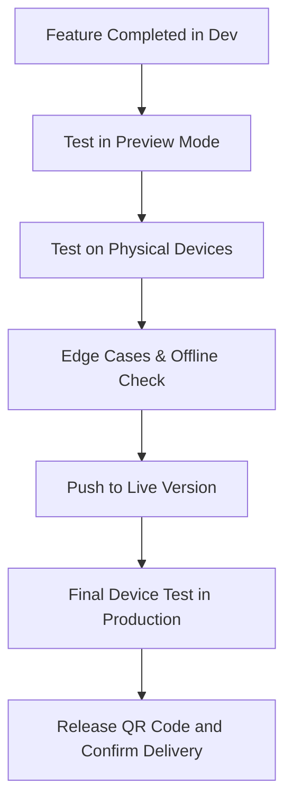

> A detailed test plan is available in this [document]().

---

## XII. Versioning & Change Management

This section defines how updates to the application and this technical specification will be tracked, deployed, and maintained over time.

---

### 12.1 Bubble Development Workflow

The application follows Bubble[¹](#glossary-bubble)’s native two-environment structure:

| Environment | Purpose                        | Access            |
|-------------|--------------------------------|-------------------|
| **Development** | Testing and staging new features | Internal only     |
| **Live**        | Stable, production-ready version | Public users      |

All changes are first implemented and validated in the **Development** environment. Only tested and approved updates are pushed to **Live**.

> ⚠️ Direct editing of the Live environment[¹⁸](#glossary-live-environment) is prohibited.

---

### 12.2 Specification Versioning

This document is versioned alongside the application. Each major update should reflect:

- Changes to database schema (new fields, new types, migrations)
- Additions to workflows[⁵](#glossary-workflow) or view logic
- New external dependencies (plugins, APIs, integrations)
- Structural or architectural shifts (e.g., authentication added)

| Document Version | Date       | Notes                                      |
|------------------|------------|--------------------------------------------|
| 1.0              | YYYY-MM-DD | Initial production release                 |
| 1.1              | TBD        | Planned: Admin dashboard + content manager |
| 2.0              | TBD        | Planned: User authentication and favorites |

> The technical spec must be updated before any major version release is deployed to Live.

---

### 12.3 Change Request Workflow

Feature changes or bug fixes must follow this process:

1. **Proposal**: Logged as a request or ticket (via Notion, GitHub, or internal tracker)  
2. **Impact Review**: Team evaluates impact on UX, performance, data model  
3. **Implementation**: Feature is developed and tested in the Development Environment[¹⁹](#glossary-development-environment)  
4. **Documentation Update**: This specification is amended if structure or logic changes  
5. **Deployment**: Change is promoted to Live with changelog entry  

---

### 12.4 Future Development Planning

The following improvements are currently outside version 1 scope but may be included in future iterations:

- User authentication and account features  
- Admin content management interface  
- Real-time pricing integration via APIs  
- Multi-store support with geolocation  
- Enhanced accessibility modes (font scaling, dark mode)  
- Data-driven personalization (favorite pairings, history)

Each new module will follow the same documentation and staging process outlined here.

---

## XIII. Conclusion

This technical specification provides a complete and detailed blueprint for the implementation of the **Intermarché Wine & Cheese Pairing App**, built on the Bubble[¹](#glossary-bubble) no-code platform. It translates the project's functional goals into actionable structures, workflows[⁵](#glossary-workflow), and technical constraints.

By adhering to the priorities defined in the functional specification, and leveraging Bubble[¹](#glossary-bubble)'s visual development capabilities, this document ensures:

- A clear understanding of app architecture, logic, and performance expectations  
- Accurate modeling of user-facing features in both French and English  
- Compliance with legal obligations regarding allergens and alcohol content  
- Realistic constraints that reflect the capabilities and limitations of Bubble[¹](#glossary-bubble)

The current version (v1) prioritizes simplicity, accessibility, and ease of maintenance. Future improvements such as a shopping list, multi-store support, and native app features are already anticipated and technically scoped to remain compatible with the current architecture.

---

### ✅ Project Readiness

With this document as reference, the development team is fully equipped to:

- Build the application confidently using Bubble[¹](#glossary-bubble)  
- Ensure functional and visual consistency with the provided mockups  
- Execute testing and deployment on time and within scope  
- Collaborate efficiently with Intermarché stakeholders during and after release

---

> This document will serve as the **source of truth** throughout development and post-launch support. Any change requests should be documented and validated before implementation.

<hr>
<h2>Glossary</h2>
<div style="font-size: 0.85em; line-height: 1.4;">
<table>
  <thead>
    <tr>
      <th>Term / Acronym</th>
      <th>Definition</th>
    </tr>
  </thead>
  <tbody>
    <tr id="glossary-bubble">
      <td><strong>Bubble</strong></td>
      <td>A no-code development platform used to create web applications visually, without programming.</td>
    </tr>
    <tr id="glossary-pwa">
      <td><strong>PWA (Progressive Web App)</strong></td>
      <td>A web application that provides native app-like experience through responsive design, offline support, and home screen installation.</td>
    </tr>
    <tr id="glossary-pwa">
      <td><strong>SPA (Single-Page Application)</strong></td>
      <td>A web app that loads a single HTML page and updates content dynamically without full reloads.</td>
    </tr>
    <tr id="glossary-custom-state">
      <td><strong>Custom State</strong></td>
      <td>A Bubble-specific variable stored temporarily on a page or element to manage UI state or user context.</td>
    </tr>
    <tr id="glossary-workflow">
      <td><strong>Workflow</strong></td>
      <td>A sequence of actions in Bubble triggered by events like button clicks or page load.</td>
    </tr>
    <tr id="glossary-repeating-group">
      <td><strong>Repeating Group</strong></td>
      <td>A visual element in Bubble used to display lists of items dynamically (e.g., dishes, products).</td>
    </tr>
    <tr id="glossary-localstorage">
      <td><strong>localStorage</strong></td>
      <td>Browser-based storage mechanism allowing small key-value pairs to persist between sessions.</td>
    </tr>
    <tr id="glossary-toolbox">
      <td><strong>Toolbox Plugin</strong></td>
      <td>A Bubble plugin allowing execution of custom JavaScript in workflows (e.g., for <code>localStorage</code>, logging, or offline checks).</td>
    </tr>
    <tr id="glossary-navigator-online">
      <td><strong>navigator.onLine</strong></td>
      <td>A JavaScript property used to check the user’s internet connectivity status.</td>
    </tr>
    <tr id="glossary-pairingrule">
      <td><strong>PairingRule</strong></td>
      <td>A custom data type linking a <code>Dish</code> to recommended <code>Wine</code> and <code>Cheese</code> options.</td>
    </tr>
    <tr id="glossary-current-view">
      <td><strong>current_view</strong></td>
      <td>A custom state used to control which group or screen is visible, simulating navigation in SPA style.</td>
    </tr>
    <tr id="glossary-responsive-engine">
      <td><strong>Responsive Engine</strong></td>
      <td>Bubble’s system for adjusting layout and element visibility based on screen size.</td>
    </tr>
    <tr id="glossary-privacy-rules">
      <td><strong>Privacy Rules</strong></td>
      <td>Bubble’s access control feature for restricting data visibility and editing permissions.</td>
    </tr>
    <tr id="glossary-offline-mode">
      <td><strong>Offline Mode</strong></td>
      <td>A fallback behavior triggered when no internet connection is detected, showing cached content.</td>
    </tr>
    <tr id="glossary-erd">
      <td><strong>ERD</strong></td>
      <td>Entity Relationship Diagram – shows how data types like <code>Dish</code>, <code>Wine</code>, and <code>Cheese</code> relate to each other.</td>
    </tr>
    <tr id="glossary-mermaid">
      <td><strong>Mermaid Diagram</strong></td>
      <td>A markdown-compatible tool used to generate flowcharts and diagrams in documentation.</td>
    </tr>
    <tr id="glossary-slug">
      <td><strong>Slug</strong></td>
      <td>A human-readable string used in URLs (e.g., <code>/dish/cassoulet</code>).</td>
    </tr>
    <tr id="glossary-qr-code">
      <td><strong>QR Code</strong></td>
      <td>A scannable code linking to the app, often used for marketing or onboarding.</td>
    </tr>
    <tr id="glossary-live-environment">
      <td><strong>Live Environment</strong></td>
      <td>The production version of the Bubble application accessible to end users.</td>
    </tr>
    <tr id="glossary-development-environment">
      <td><strong>Development Environment</strong></td>
      <td>The staging SPA ce in Bubble used for testing and preparing updates before deployment.</td>
    </tr>
  </tbody>
</table>
</div>