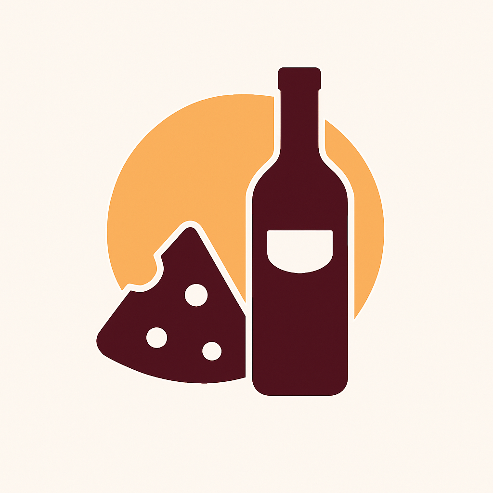

# 🍷🧀 Wine & Cheese Pairing – Wine Advising Web App  
**Project for Intermarché Saint-Rémy-de-Provence**

  <a href="#overview">Overview</a> •
  <a href="#client-needs">Client Needs</a> •
  <a href="#technology-stack">Technology Stack</a> •
  <a href="#what-is-bubble">What is Bubble?</a> •
  <a href="#documents">Documents</a> •
  <a href="#deployment">Deployment</a> •
  <a href="#license">License</a>

  

## 📖 Overview

This project is a collaborative effort between **ALGOSUP International Software Development School** and **Intermarché of Saint-Rémy-de-Provence**, aimed at designing a **web application that recommends wine bottles based on a selected cheese**.

The goal is to replicate the knowledge and experience of an in-store wine expert and make it digitally accessible to customers through a seamless, user-friendly interface.

<b>👥 Contributors</b>

 

| Photo | Role | Name | Contact |
|-------|------|------|---------|
|  | Project Manager | Ian LAURENT |          |
|  | Program Manager | Mathias DELILLE |      |
|  | Tech Lead | Remy CHARLES |                       |
|  | Software Developer | Paul NOWAK |                   |
|  | Quality Assurance | Benoît DE KEYN |  |

## 🔍 Client Needs

- Provide an intuitive interface for customers to discover ideal wine pairings for cheeses.
- Digitally capture and share the in-store wine expert’s recommendations.
- Enable **fast delivery and agile feedback loops** through iterative prototypes.
- Ensure the application is **simple, responsive, and effortless to use** for non-technical users.

## 🧰 Technology Stack

The project will be developed using **Bubble**, a no-code development platform that supports rapid prototyping and user-friendly web app creation without traditional coding.

## ❓ What is Bubble?

**[Bubble](https://bubble.io)** is a no-code platform that allows users to build fully functional, interactive web apps through a visual editor. It includes:

- Custom drag-and-drop UI building
- Built-in database and backend logic
- Workflow automation and conditions
- Third-party API integrations

Bubble is perfect for MVPs, client prototypes, and projects that require **speed + flexibility**.

## 📄 Documents

Key project documentation will be published here as the project progresses:

- 📘 Project Charter – _Coming Soon_
- 📑 Functional Specifications – _Coming Soon_
- ⚙️ Technical Approach – _Coming Soon_
- ✅ Test Plan – _Coming Soon_
- 📆 Timeline & Milestones – _Coming Soon_
- 📝 Weekly Reports – _Coming Soon_

---

## 🚧 Deployment

There is no live deployment yet. Links to working prototypes and public releases will be added here once available.

---

## 📜 License

This project is licensed under the MIT License. See the [LICENSE](https://github.com/algosup/2024-2025-project-5-bubble-intermarche-team-5/blob/main/LICENSE) file for full details.

---

> For more information, contact the project manager via Slack or email.